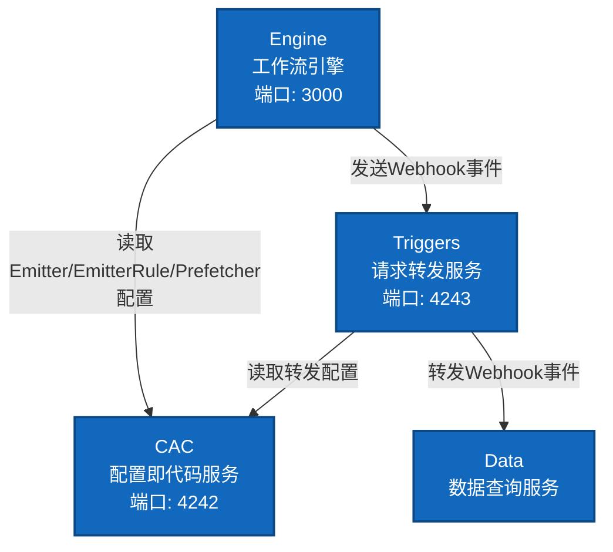

# ES-Workflow 应用架构

## 系统概览

ES-Workflow 是一个基于事件驱动的工作流引擎系统，由多个独立服务组成，通过配置化的方式实现工作流编排、请求转发和系统集成。

## 应用层架构图

## 核心服务

- **Engine** (端口 3000): 工作流引擎，负责工作流实例执行和状态机推进
- **Triggers** (端口 4243): 请求转发服务，负责HTTP请求转换与分发
- **CAC** (端口 4242): 配置即代码服务，负责Git版本化配置管理
- **Data**: 数据查询服务，通过Triggers转发的webhook事件同步运行数据，提供数据查询API

## 端口分配

| 服务 | 端口 | 说明 |
|------|------|------|
| Engine | 3000 | 工作流引擎API |
| CAC | 4242 | 配置管理API |
| Triggers | 4243 | 请求转发服务 |

## 技术栈

- Node.js + Koa
- ES Modules
- Redis (es-ioredis-url)
- Git集成

### 工具库
- cac-client: 配置客户端
- es-fetch-api: HTTP客户端
- dayjs: 日期处理
- es-object-id: ID生成
- yaml: YAML处理

## 关键设计模式

1. **配置即代码（Configuration as Code）**: 所有配置通过Git版本控制
2. **事件驱动架构（Event-Driven Architecture）**: Webhook机制驱动系统交互
3. **管道过滤器模式（Pipeline Pattern）**: Triggers的请求处理流程
4. **状态机模式（State Machine）**: Engine的工作流执行
5. **缓存优先（Cache-Aside）**: CAC的多层缓存机制
