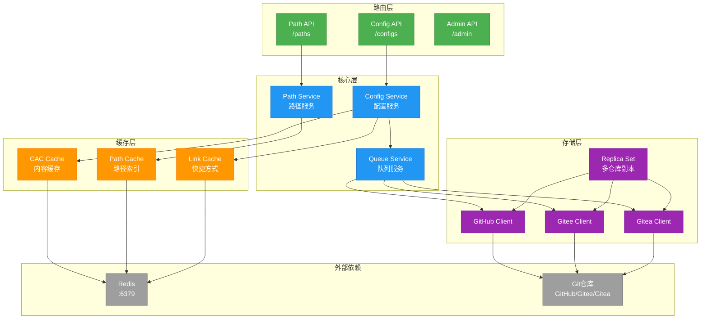
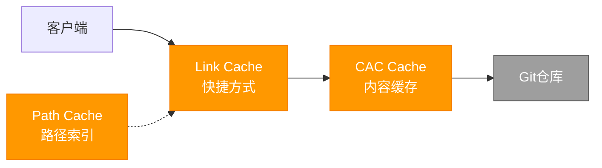
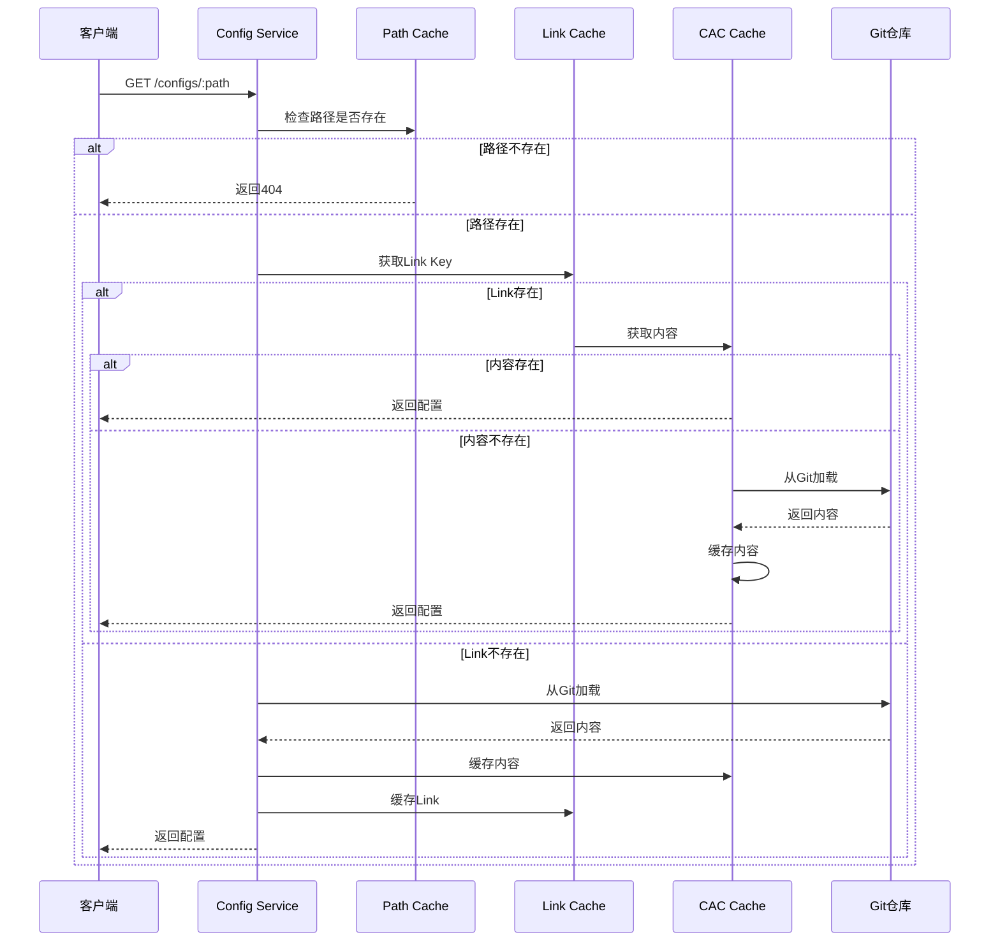
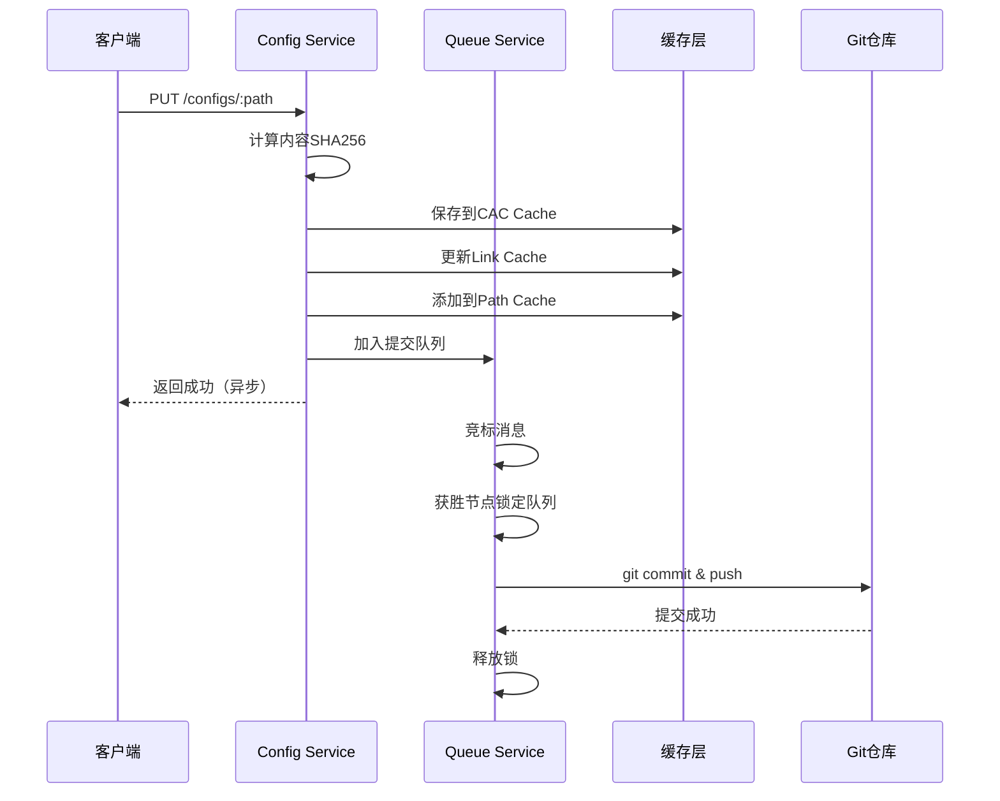
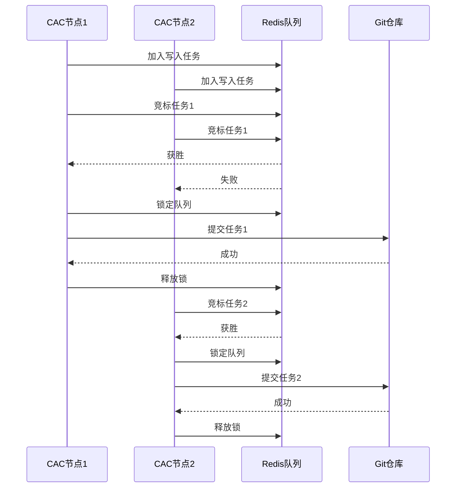

# CAC 应用架构

## 概述

CAC (Configuration as Code) 是ES-Workflow的配置即代码服务，负责配置文件的版本化管理。基于Node.js + Koa构建，运行在4242端口。支持GitHub、Gitee、Gitea三种Git平台，提供多层缓存机制和并发写入队列管理。

## 架构图



## 核心组件

### 1. Config Service（配置服务）

**职责**：
- 配置文件的CRUD操作
- 多层缓存管理
- 版本控制集成

**核心方法**：
- `getConfig(path, ref)`: 获取单个配置
- `getConfigs(path, ref)`: 获取路径下所有配置
- `saveConfig(path, content)`: 保存配置
- `deleteConfig(path)`: 删除配置

### 2. Path Service（路径服务）

**职责**：
- 维护配置文件路径索引
- 支持路径前缀查询

**核心方法**：
- `addPath(path)`: 添加路径到索引
- `removePath(path)`: 从索引移除路径
- `scanPaths(prefix)`: 扫描匹配前缀的路径

### 3. Queue Service（队列服务）

**职责**：
- 管理Git提交队列
- 实现分布式锁机制
- 串行化并发写入

**工作流程**：
1. 写入操作加入队列
2. 多个CAC节点竞标消息
3. 获胜节点锁定队列
4. 执行Git提交
5. 释放锁

## 缓存机制

### 三层缓存结构



### 1. Link Cache（快捷方式缓存）

**Key格式**：`cac_link:<path>:<ref>`

**Value**：内容的Key（`cac:<blob_sha>`）

**用途**：
- 快速定位配置内容
- 支持不同ref的版本访问

**示例**：
```
cac_link:/workflow/deploy-workflow:HEAD → cac:a1b2c3d4...
cac_link:/workflow/deploy-workflow:v1.0 → cac:e5f6g7h8...
```

### 2. CAC Cache（内容缓存）

**Key格式**：`cac:<blob_sha>`

**Value**：配置文件内容（YAML/JSON）

**SHA256计算**：
- 基于内容计算SHA256
- 不依赖Git的blob SHA
- 保存时立即建立缓存，无需等待Git提交

**用途**：
- 存储配置文件内容
- 内容去重（相同内容共享缓存）

### 3. Path Cache（路径索引缓存）

**Key格式**：`{cac_paths}:<namespace>`

**Value**：文件路径的Set

**用途**：
- 快速判断路径是否存在
- 支持路径前缀扫描
- 批量获取配置时提高性能

**示例**：
```
{cac_paths}:default → Set([
  "/workflow/deploy-workflow",
  "/workflow/test-workflow",
  "/emitter/github-emitter"
])
```

## 配置读取流程



## 配置保存流程



## Git平台适配

### 支持的平台

1. **GitHub**
   - 使用GitHub API
   - 支持Personal Access Token认证

2. **Gitee**
   - 使用Gitee API
   - 支持Private Token认证

3. **Gitea**
   - 使用Gitea API
   - 支持Token认证

### Replica Set（副本集）

**用途**：
- 同时向多个Git仓库提交
- 实现配置的多地备份
- 提高可用性

**配置示例**：
```javascript
{
  primary: {
    type: 'github',
    repo: 'org/configs',
    token: 'ghp_xxx'
  },
  replicas: [
    {
      type: 'gitee',
      repo: 'org/configs',
      token: 'xxx'
    },
    {
      type: 'gitea',
      repo: 'org/configs',
      token: 'xxx'
    }
  ]
}
```

## API路由

### Config API

**获取单个配置**：
```
GET /configs/:kind/:name?ref=<ref>
```
- `kind`: 配置类型（如workflow、trigger）
- `name`: 配置名称
- `ref`: Git引用（可选，默认HEAD）

**获取路径下所有配置**：
```
GET /configs/:kind?ref=<ref>
```

**保存配置**：
```
PUT /configs/:kind/:name
Content-Type: application/yaml

<配置内容>
```

**删除配置**：
```
DELETE /configs/:kind/:name
```

### Path API

**获取所有路径**：
```
GET /paths
```

**扫描路径前缀**：
```
GET /paths?prefix=<prefix>
```

### Admin API

**清除缓存**：
```
POST /admin/cache/clear
```

**查看队列状态**：
```
GET /admin/queue/status
```

## 数据格式

### YAML格式（推荐）

```yaml
kind: workflow
name: deploy-workflow
metadata:
  title: 部署工作流
spec:
  # 配置内容
```

### JSON格式

```json
{
  "kind": "workflow",
  "name": "deploy-workflow",
  "metadata": {
    "title": "部署工作流"
  },
  "spec": {
    // 配置内容
  }
}
```

## 并发控制

### 队列机制

**问题**：多个CAC节点同时写入会导致Git冲突

**解决方案**：
1. 所有写入操作加入Redis队列
2. 使用Redis分布式锁实现竞标
3. 获胜节点串行执行Git提交
4. 其他节点等待或重试

### 竞标流程



## 关键设计

### 1. 多层缓存
通过Link Cache、CAC Cache、Path Cache三层缓存，最大化读取性能。

### 2. 内容寻址
使用SHA256作为内容Key，实现内容去重和快速缓存。

### 3. 异步提交
配置保存立即返回，Git提交异步执行，提高响应速度。

### 4. 分布式锁
使用Redis实现分布式锁，解决多节点并发写入问题。

### 5. 平台适配
抽象Git操作接口，支持多种Git平台。

### 6. 副本集
支持多仓库同步，提高可用性和容灾能力。

## 技术栈

- **框架**: Koa (koa-es-template)
- **语言**: ES Modules
- **Redis**: es-ioredis-url
- **YAML**: yaml
- **Git客户端**: 自定义实现（基于Git API）

## 配置示例

### .env
```bash
# Redis配置
REDIS_URL=redis://localhost

# Git配置
GIT_PLATFORM=github
GIT_REPO=org/configs
GIT_TOKEN=ghp_xxx
GIT_BRANCH=main

# 服务端口
PORT=4242

# 命名空间
NAMESPACE=default
```

## 目录结构

```
cac/
├── src/
│   ├── core/
│   │   └── infrastructure/
│   │       ├── cache/              # 缓存层
│   │       │   ├── cac-cache/      # 内容缓存
│   │       │   └── path-cache/     # 路径缓存
│   │       ├── presentation/       # 数据格式
│   │       │   ├── json.js         # JSON格式
│   │       │   └── yaml.js         # YAML格式
│   │       ├── queue/              # 队列服务
│   │       └── storage/            # 存储层
│   │           └── github/         # Git客户端
│   │               └── clients/
│   │                   ├── github.js
│   │                   ├── gitee.js
│   │                   ├── gitea.js
│   │                   └── replica-set.js
│   ├── routes/                     # API路由
│   │   ├── configs.js              # Config API
│   │   ├── paths.js                # Path API
│   │   └── admin.js                # Admin API
│   ├── utils/                      # 工具函数
│   └── index.js                    # 应用入口
└── .env                            # 环境配置
```

## 性能优化

### 读取优化
1. **三层缓存**：Link → CAC → Git，逐层降级
2. **批量预加载**：扫描路径时批量加载配置
3. **内容去重**：相同内容共享缓存

### 写入优化
1. **立即缓存**：保存时立即更新缓存，无需等待Git
2. **异步提交**：Git提交异步执行，不阻塞响应
3. **批量提交**：队列中的多个操作可以合并提交

### 缓存失效
- **主动失效**：配置更新时清除相关缓存
- **被动失效**：设置TTL，定期过期
- **手动清除**：提供Admin API清除缓存
