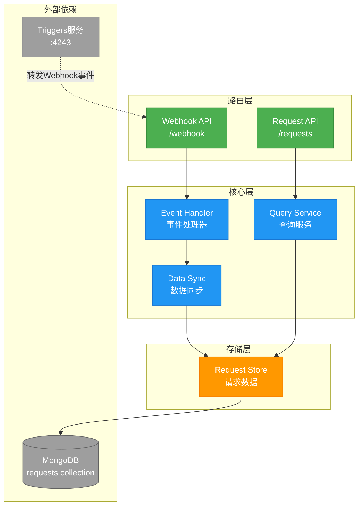
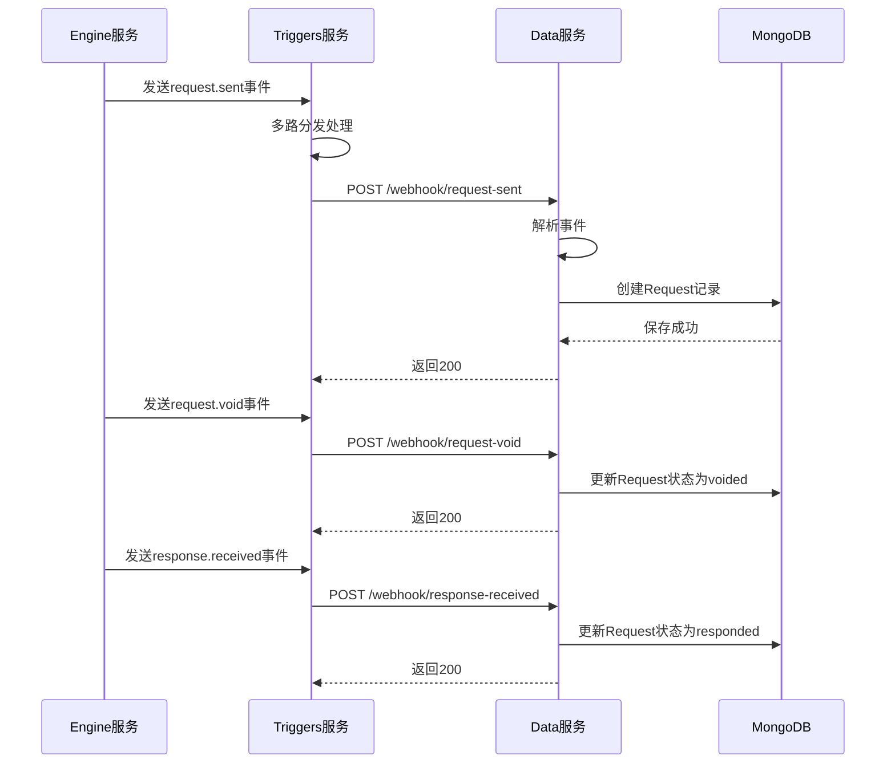

# Data 应用架构

## 概述

Data是ES-Workflow的数据查询服务，负责提供工作流运行数据的查询API。通过接收Triggers转发的webhook事件来同步运行数据，并提供高效的查询接口。基于Node.js + Koa构建，运行在4244端口。

## 事件转发配置

Data服务通过Triggers接收来自Engine的webhook事件。采用**多路分发**机制，在现有的listener上增加新的trigger，实现一个事件同时转发到Engine和Data两个目标。

**转发链路**：
```
Engine → Triggers (listener) → 多路分发
                                ├─→ Engine (原有trigger)
                                └─→ Data (新增trigger)
```

**配置的事件**：
1. **request.sent** - 请求发送事件
   - Engine webhook: `WEBHOOK_REQUEST_SENT=http://localhost:4243/hook/engine-request-sent-listener`
   - Triggers listener: `engine-request-sent-listener` (配置了2个trigger)
     - `engine-request-sent-trigger` → Engine webhook API
     - `data-request-sent-trigger` → Data webhook API
   - Data endpoint: `POST /webhook/request-sent`

2. **request.void** - 请求作废事件
   - Engine webhook: `WEBHOOK_REQUEST_VOID=http://localhost:4243/hook/engine-request-void-listener`
   - Triggers listener: `engine-request-void-listener` (配置了2个trigger)
     - `engine-request-void-trigger` → Engine webhook API
     - `data-request-void-trigger` → Data webhook API
   - Data endpoint: `POST /webhook/request-void`

3. **response.received** - 响应接收事件
   - Engine webhook: `WEBHOOK_RESPONSE_RECEIVED=http://localhost:4243/hook/engine-response-received-listener`
   - Triggers listener: `engine-response-received-listener` (配置了2个trigger)
     - `engine-response-received-trigger` → Engine webhook API
     - `data-response-received-trigger` → Data webhook API
   - Data endpoint: `POST /webhook/response-received`

**配置文件**：
- `/cac-configs/engine-webhooks-all.yaml`: 修改三个listener，添加data-*-trigger
- `/cac-configs/data-webhooks.yaml`: 新增配置，包含：
  - `target-system`: data-webhook-api (指向Data服务的webhook端点)
  - `binding`: data-webhook-binding (数据绑定脚本)
  - `template`: 三个事件模板 (定义转发的数据格式)
  - `trigger`: 三个触发器 (关联binding和template)
  - `target-request`: 三个目标请求 (执行转发并记录日志)

## 架构图



## 核心组件

### 1. Event Handler（事件处理器）

**职责**：
- 接收Triggers转发的webhook事件
- 解析事件类型和数据
- 分发到对应的处理器

**支持的事件类型**：
- `run.started`: 工作流开始
- `run.completed`: 工作流完成
- `task.started`: 任务开始
- `task.completed`: 任务完成
- `task.updated`: 任务更新
- `request.sent`: 请求发送
- `request.void`: 请求作废
- `response.received`: 响应接收

**事件处理流程**：
```javascript
{
  eventType: 'run.started',
  runId: 'xxx',
  workflowId: 'deploy-workflow',
  timestamp: 1234567890,
  data: { /* 事件数据 */ }
}
```

### 2. Data Sync（数据同步）

**职责**：
- 根据webhook事件同步请求数据
- 维护请求状态的完整生命周期
- 处理事件顺序和重复

**同步策略**：
- **专注请求**: 只同步和管理HTTP请求数据
- **幂等性**: request.sent使用insert，void和received使用update，重复事件不会导致数据错误
- **状态追踪**: 完整记录请求的sent、voided、responded状态

**MongoDB Collection**：
- `requests` - HTTP请求记录（唯一collection）

**事件处理逻辑**：

#### request.sent 事件
1. **创建Request**: insert request到 `requests` collection
   - 状态: `sent`
   - 包含: requestId, runId, taskId, taskName, request数据, sentAt时间

#### request.void 事件
1. **更新Request**: 更新request状态和作废信息
   - 状态: `voided`
   - 记录: action, reason, voidedAt时间

#### response.received 事件
1. **添加Response**: 将response添加到requests的responses数组
2. **条件更新状态**: 仅当response.kind为'decision'时
   - 更新request状态为 `responded`
   - 记录respondedAt时间

**数据模型**：

#### Request（请求）
```javascript
{
  _id: String,              // requestId
  runId: String,            // 所属运行ID
  taskId: String,           // 所属任务ID
  taskName: String,         // 任务显示名称 (task.name || task.stateName)
  url: String,              // 请求URL
  method: String,           // HTTP方法
  headers: Object,          // 请求头
  body: Object,             // 请求体
  status: 'sent' | 'voided' | 'responded',  // 请求状态
  responses: [{             // 响应数组 (一个请求可以有多个响应)
    kind: String,           // 响应类型 (decision, notification等)
    status: Number,
    statusText: String,
    headers: Object,
    body: Object,
    receivedAt: Date
  }],
  sentAt: Date,             // 发送时间
  voidedAt: Date,           // 作废时间 (可选)
  respondedAt: Date,        // 最终响应时间 (可选，仅当收到decision响应时设置)
  action: String,           // 作废动作 (可选: cancel, retry, skip)
  reason: String,           // 作废原因 (可选)
  createdAt: Date,          // 创建时间
  updatedAt: Date           // 更新时间
}
```

**状态流转**：
```
sent → voided (请求被作废)
sent → responded (收到decision响应)
```

**响应处理规则**：
- 一个request可以收到多个response
- 所有response都会被添加到responses数组
- 只有当response.kind为'decision'时，才会更新request状态为'responded'

### 3. Query Service（查询服务）

**职责**：
- 提供请求数据查询API
- 支持复杂查询和聚合
- 分页和排序

**查询能力**：
- 按Request ID查询单个请求
- 按Run ID查询运行的所有请求
- 按Task ID查询任务的所有请求
- 按时间范围查询
- 按状态筛选 (sent/voided/responded)
- 按任务名称搜索
- 聚合统计 (成功率、响应时间等)

## 数据同步流程



## API路由

### Webhook API（接收事件）

**接收request事件**：
```
POST /webhook/request-sent       # 请求发送事件
POST /webhook/request-void       # 请求作废事件
POST /webhook/response-received  # 响应接收事件
```

**请求格式**：
```json
{
  "eventType": "request.sent",
  "runId": "507f1f77bcf86cd799439011",
  "taskId": "507f191e810c19729de860ea",
  "requestId": "507f191e810c19729de860eb",
  "workflowId": "deploy-workflow",
  "timestamp": 1234567890,
  "run": { /* Run对象 */ },
  "task": { /* Task对象 */ },
  "request": { /* Request对象 */ }
}
```

**响应格式**：
```json
{
  "success": true,
  "message": "request.sent event processed successfully",
  "data": {
    "runId": "507f1f77bcf86cd799439011",
    "taskId": "507f191e810c19729de860ea",
    "requestId": "507f191e810c19729de860eb",
    "timestamp": 1234567890
  }
}
```

### Query API（查询数据）

**查询Request**：
```
GET /requests/query              # 查询Request列表
GET /requests/query?target=xxx   # 按target查询
GET /requests/query?status=sent  # 按状态查询
GET /requests/query?target=xxx&status=sent  # 按target和status组合查询
GET /requests/query?page=1&pageSize=20      # 分页查询
```

**查询参数**：
- `target`: 请求目标（可选）
- `status`: 请求状态（可选，值：sent/voided/responded）
- `page`: 页码（可选，默认1）
- `pageSize`: 每页数量（可选，默认20）

**响应格式**：
```json
{
  "success": true,
  "data": {
    "requests": [
      {
        "_id": "507f191e810c19729de860eb",
        "runId": "507f1f77bcf86cd799439011",
        "taskId": "507f191e810c19729de860ea",
        "taskName": "审核",
        "target": "user1",
        "status": "sent",
        "responses": [],
        "sentAt": "2024-01-01T00:00:00.000Z",
        "createdAt": "2024-01-01T00:00:00.000Z"
      }
    ],
    "pagination": {
      "page": 1,
      "pageSize": 20,
      "total": 100,
      "totalPages": 5
    }
  }
}
```

## 数据存储

### MongoDB

**选择原因**：
- 文档模型适合存储请求数据的复杂结构
- 灵活的schema适应request数据的多样性
- 强大的查询和聚合能力
- 良好的水平扩展性

**Collection设计**：
- `requests` - 存储所有HTTP请求记录

**索引设计**：
```javascript
db.requests.createIndex({ target: 1, status: 1, createdAt: -1 })
db.requests.createIndex({ target: 1, createdAt: -1 })
db.requests.createIndex({ status: 1, createdAt: -1 })
db.requests.createIndex({ runId: 1, createdAt: -1 })
db.requests.createIndex({ taskId: 1, createdAt: -1 })
db.requests.createIndex({ sentAt: -1 })
db.requests.createIndex({ taskName: 1 })
```

## 性能优化

### 1. 索引策略

所有查询都基于上述索引设计,确保高效的查询性能。

### 2. 查询优化

**分页优化**：
- 使用游标分页代替offset
- 限制最大pageSize为100

**聚合优化**：
- 使用MongoDB聚合管道
- 预计算常用统计指标

## 数据一致性

### 幂等性保证

**request.sent事件**：
- 使用insertOne操作
- 如果requestId已存在会抛出重复键错误
- 客户端可以安全重试

**request.void和response.received事件**：
- 使用updateOne操作
- 重复更新不会导致数据错误
- 保持最终一致性

## 关键设计

### 1. 事件驱动同步
通过webhook事件实现请求数据同步，解耦Engine和Data服务。

### 2. 专注请求管理
只管理HTTP请求数据，不处理Run和Task数据，保持服务职责单一。

### 3. 最终一致性
接受短暂的数据不一致，通过幂等性设计保证最终一致。

### 4. 灵活查询
支持多维度查询（runId、taskId、status、taskName等）。

## 技术栈

- **框架**: Koa (koa-es-template)
- **语言**: ES Modules
- **数据库**: MongoDB
- **端口**: 4244

## 配置示例

### .env
```bash
# 数据库配置
DATABASE_TYPE=mongodb
DATABASE_URL=mongodb://localhost:27017/es-workflow

# Redis配置
REDIS_URL=redis://localhost

# 服务端口
PORT=4244

# Webhook认证
WEBHOOK_SECRET=your-secret-key
```

## 目录结构

```
data/
├── src/
│   ├── core/
│   │   ├── event-handler/       # 事件处理器
│   │   │   ├── run-events.js
│   │   │   ├── task-events.js
│   │   │   └── request-events.js
│   │   ├── data-sync/           # 数据同步
│   │   │   ├── run-sync.js
│   │   │   ├── task-sync.js
│   │   │   └── request-sync.js
│   │   └── query-service/       # 查询服务
│   │       ├── run-query.js
│   │       ├── task-query.js
│   │       ├── request-query.js
│   │       └── stats-query.js
│   ├── models/                  # 数据模型
│   │   ├── run.js
│   │   ├── task.js
│   │   ├── request.js
│   │   └── event.js
│   ├── routes/                  # API路由
│   │   ├── webhook.js           # Webhook API
│   │   ├── runs.js              # Run API
│   │   ├── tasks.js             # Task API
│   │   ├── requests.js          # Request API
│   │   └── stats.js             # Stats API
│   ├── utils/                   # 工具函数
│   └── index.js                 # 应用入口
└── .env                         # 环境配置
```

## 监控指标

### 业务指标
- 工作流执行总数
- 工作流成功率
- 平均执行时间
- 任务失败率

### 技术指标
- 事件处理延迟
- 数据同步延迟
- 查询响应时间
- 数据库连接数

### 告警规则
- 事件处理失败率 > 1%
- 数据同步延迟 > 10秒
- 查询响应时间 > 1秒
- 数据库连接数 > 80%
