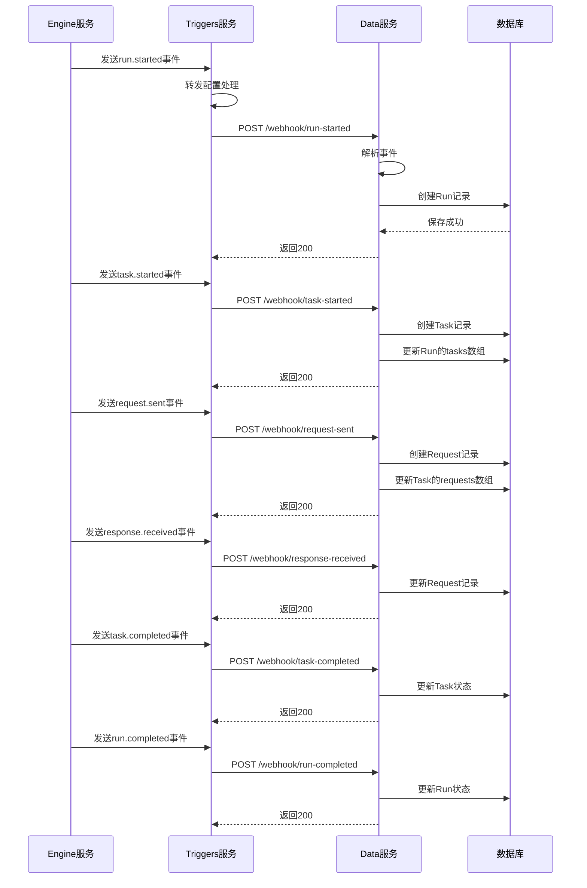

# Data 应用架构

## 概述

Data是ES-Workflow的数据查询服务，负责提供工作流运行数据的查询API。通过接收Triggers转发的webhook事件来同步运行数据，并提供高效的查询接口。基于Node.js + Koa构建。

## 架构图

```mermaid
graph TB
    subgraph Routes[路由层]
        QueryAPI[Query API<br/>/query]
        RunAPI[Run API<br/>/runs]
        TaskAPI[Task API<br/>/tasks]
        WebhookAPI[Webhook API<br/>/webhook]
    end
    
    subgraph Core[核心层]
        EventHandler[Event Handler<br/>事件处理器]
        QueryService[Query Service<br/>查询服务]
        DataSync[Data Sync<br/>数据同步]
    end
    
    subgraph Storage[存储层]
        RunStore[Run Store<br/>运行数据]
        TaskStore[Task Store<br/>任务数据]
        RequestStore[Request Store<br/>请求数据]
        EventStore[Event Store<br/>事件数据]
    end
    
    subgraph External[外部依赖]
        Triggers[Triggers服务<br/>:4243]
        Database[(数据库<br/>MongoDB/PostgreSQL)]
    end
    
    WebhookAPI --> EventHandler
    QueryAPI --> QueryService
    RunAPI --> QueryService
    TaskAPI --> QueryService
    
    EventHandler --> DataSync
    DataSync --> RunStore
    DataSync --> TaskStore
    DataSync --> RequestStore
    DataSync --> EventStore
    
    QueryService --> RunStore
    QueryService --> TaskStore
    QueryService --> RequestStore
    QueryService --> EventStore
    
    RunStore --> Database
    TaskStore --> Database
    RequestStore --> Database
    EventStore --> Database
    
    Triggers -.->|转发Webhook事件| WebhookAPI
    
    classDef routeStyle fill:#4CAF50,stroke:#388E3C,color:#fff
    classDef coreStyle fill:#2196F3,stroke:#1976D2,color:#fff
    classDef storageStyle fill:#FF9800,stroke:#F57C00,color:#fff
    classDef externalStyle fill:#9E9E9E,stroke:#616161,color:#fff
    
    class QueryAPI,RunAPI,TaskAPI,WebhookAPI routeStyle
    class EventHandler,QueryService,DataSync coreStyle
    class RunStore,TaskStore,RequestStore,EventStore storageStyle
    class Triggers,Database externalStyle
```



## 核心组件

### 1. Event Handler（事件处理器）

**职责**：
- 接收Triggers转发的webhook事件
- 解析事件类型和数据
- 分发到对应的处理器

**支持的事件类型**：
- `run.started`: 工作流开始
- `run.completed`: 工作流完成
- `task.started`: 任务开始
- `task.completed`: 任务完成
- `task.updated`: 任务更新
- `request.sent`: 请求发送
- `request.void`: 请求作废
- `response.received`: 响应接收

**事件处理流程**：
```javascript
{
  eventType: 'run.started',
  runId: 'xxx',
  workflowId: 'deploy-workflow',
  timestamp: 1234567890,
  data: { /* 事件数据 */ }
}
```

### 2. Data Sync（数据同步）

**职责**：
- 根据事件更新数据存储
- 维护数据一致性
- 处理事件顺序和重复

**同步策略**：
- **增量同步**：只更新变化的数据
- **幂等性**：重复事件不会导致数据错误
- **顺序保证**：使用timestamp确保事件顺序

**数据模型**：

#### Run（工作流实例）
```javascript
{
  id: String,
  workflowId: String,
  workflowName: String,
  status: 'initialized' | 'running' | 'completed',
  startTime: Date,
  endTime: Date,
  inputParameters: Object,
  outputParameters: Object,
  tasks: [TaskId],
  createdAt: Date,
  updatedAt: Date
}
```

#### Task（任务）
```javascript
{
  id: String,
  runId: String,
  stateName: String,
  status: 'pending' | 'running' | 'completed' | 'failed',
  startTime: Date,
  endTime: Date,
  inputParameters: Object,
  outputParameters: Object,
  requests: [RequestId],
  createdAt: Date,
  updatedAt: Date
}
```

#### Request（请求）
```javascript
{
  id: String,
  taskId: String,
  runId: String,
  url: String,
  method: String,
  headers: Object,
  body: Object,
  status: 'pending' | 'sent' | 'completed' | 'failed' | 'void',
  sentTime: Date,
  completedTime: Date,
  response: {
    status: Number,
    headers: Object,
    body: Object
  },
  createdAt: Date,
  updatedAt: Date
}
```

#### Event（事件）
```javascript
{
  id: String,
  eventType: String,
  runId: String,
  taskId: String,
  requestId: String,
  timestamp: Date,
  data: Object,
  createdAt: Date
}
```

### 3. Query Service（查询服务）

**职责**：
- 提供数据查询API
- 支持复杂查询和聚合
- 分页和排序

**查询能力**：
- 按Run ID查询完整运行数据
- 按Workflow ID查询历史运行
- 按时间范围查询
- 按状态筛选
- 全文搜索
- 聚合统计

## 数据同步流程



## API路由

### Webhook API（接收事件）

**接收run事件**：
```
POST /webhook/run-started
POST /webhook/run-completed
```

**接收task事件**：
```
POST /webhook/task-started
POST /webhook/task-completed
POST /webhook/task-updated
```

**接收request事件**：
```
POST /webhook/request-sent
POST /webhook/request-void
POST /webhook/response-received
```

### Query API（查询数据）

**查询Run**：
```
GET /runs/:id                    # 获取单个Run详情
GET /runs                        # 查询Run列表
GET /runs/:id/tasks              # 获取Run的所有Task
GET /runs/:id/timeline           # 获取Run的时间线
```

**查询Task**：
```
GET /tasks/:id                   # 获取单个Task详情
GET /tasks                       # 查询Task列表
GET /tasks/:id/requests          # 获取Task的所有Request
```

**查询Request**：
```
GET /requests/:id                # 获取单个Request详情
GET /requests                    # 查询Request列表
```

**统计查询**：
```
GET /stats/runs                  # Run统计
GET /stats/workflows             # Workflow统计
GET /stats/success-rate          # 成功率统计
```

### 查询参数

**分页**：
```
?page=1&pageSize=20
```

**排序**：
```
?sortBy=createdAt&order=desc
```

**筛选**：
```
?status=completed
?workflowId=deploy-workflow
?startTime=2024-01-01&endTime=2024-12-31
```

**搜索**：
```
?search=keyword
```

## 数据存储选型

### 方案1: MongoDB

**优势**：
- 文档模型适合嵌套数据
- 灵活的Schema
- 良好的查询性能
- 支持聚合管道

**适用场景**：
- 数据结构变化频繁
- 需要灵活查询
- 数据量中等

### 方案2: PostgreSQL

**优势**：
- 强大的关系查询
- JSONB支持
- 事务保证
- 成熟稳定

**适用场景**：
- 需要复杂关联查询
- 数据一致性要求高
- 需要事务支持

### 方案3: 时序数据库（InfluxDB/TimescaleDB）

**优势**：
- 针对时序数据优化
- 高效的时间范围查询
- 自动数据压缩
- 聚合性能好

**适用场景**：
- 大量时序数据
- 主要按时间查询
- 需要高性能聚合

## 性能优化

### 1. 索引策略

**MongoDB索引**：
```javascript
// Run集合
db.runs.createIndex({ id: 1 }, { unique: true })
db.runs.createIndex({ workflowId: 1, createdAt: -1 })
db.runs.createIndex({ status: 1, createdAt: -1 })

// Task集合
db.tasks.createIndex({ id: 1 }, { unique: true })
db.tasks.createIndex({ runId: 1, createdAt: -1 })
db.tasks.createIndex({ status: 1 })

// Request集合
db.requests.createIndex({ id: 1 }, { unique: true })
db.requests.createIndex({ taskId: 1, createdAt: -1 })
db.requests.createIndex({ runId: 1 })
```

### 2. 缓存策略

**热数据缓存**：
- 最近的Run数据缓存到Redis
- TTL: 1小时
- 缓存Key: `data:run:{id}`

**统计数据缓存**：
- 统计结果缓存
- TTL: 5分钟
- 缓存Key: `data:stats:{type}:{params}`

### 3. 查询优化

**分页优化**：
- 使用游标分页代替offset
- 限制最大pageSize

**聚合优化**：
- 使用数据库聚合功能
- 预计算常用统计指标

**关联查询优化**：
- 适当使用数据冗余
- 减少多表join

## 数据一致性

### 事件顺序保证

**问题**：网络延迟可能导致事件乱序

**解决方案**：
1. 使用timestamp排序事件
2. 延迟处理机制（等待乱序事件）
3. 版本号机制（检测冲突）

### 幂等性保证

**问题**：重复事件可能导致数据重复

**解决方案**：
1. 使用事件ID去重
2. 更新操作使用upsert
3. 状态机验证（只允许合法状态转换）

### 数据修复

**定期对账**：
- 定期从Engine同步完整数据
- 检测并修复不一致

**手动修复**：
- 提供Admin API手动触发同步
- 支持重放事件

## 关键设计

### 1. 事件驱动同步
通过webhook事件实现数据同步，解耦Engine和Data服务。

### 2. 最终一致性
接受短暂的数据不一致，通过事件重放和对账保证最终一致。

### 3. 读写分离
写入通过webhook异步处理，读取提供高性能查询API。

### 4. 多级缓存
热数据缓存到Redis，减少数据库压力。

### 5. 灵活存储
支持多种数据库选型，适应不同场景需求。

## 技术栈

- **框架**: Koa (koa-es-template)
- **语言**: ES Modules
- **数据库**: MongoDB / PostgreSQL / TimescaleDB（可选）
- **缓存**: Redis (es-ioredis-url)
- **ORM**: Mongoose / Sequelize（根据数据库选型）

## 配置示例

### .env
```bash
# 数据库配置
DATABASE_TYPE=mongodb
DATABASE_URL=mongodb://localhost:27017/es-workflow

# Redis配置
REDIS_URL=redis://localhost

# 服务端口
PORT=4244

# Webhook认证
WEBHOOK_SECRET=your-secret-key
```

## 目录结构

```
data/
├── src/
│   ├── core/
│   │   ├── event-handler/       # 事件处理器
│   │   │   ├── run-events.js
│   │   │   ├── task-events.js
│   │   │   └── request-events.js
│   │   ├── data-sync/           # 数据同步
│   │   │   ├── run-sync.js
│   │   │   ├── task-sync.js
│   │   │   └── request-sync.js
│   │   └── query-service/       # 查询服务
│   │       ├── run-query.js
│   │       ├── task-query.js
│   │       ├── request-query.js
│   │       └── stats-query.js
│   ├── models/                  # 数据模型
│   │   ├── run.js
│   │   ├── task.js
│   │   ├── request.js
│   │   └── event.js
│   ├── routes/                  # API路由
│   │   ├── webhook.js           # Webhook API
│   │   ├── runs.js              # Run API
│   │   ├── tasks.js             # Task API
│   │   ├── requests.js          # Request API
│   │   └── stats.js             # Stats API
│   ├── utils/                   # 工具函数
│   └── index.js                 # 应用入口
└── .env                         # 环境配置
```

## 监控指标

### 业务指标
- 工作流执行总数
- 工作流成功率
- 平均执行时间
- 任务失败率

### 技术指标
- 事件处理延迟
- 数据同步延迟
- 查询响应时间
- 数据库连接数

### 告警规则
- 事件处理失败率 > 1%
- 数据同步延迟 > 10秒
- 查询响应时间 > 1秒
- 数据库连接数 > 80%
