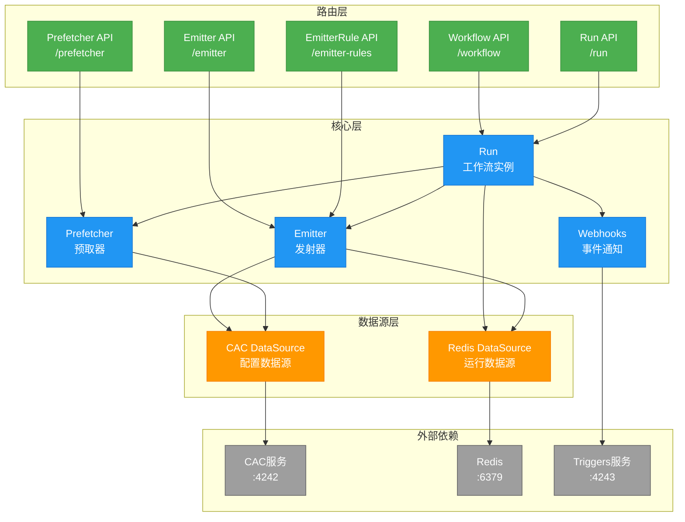
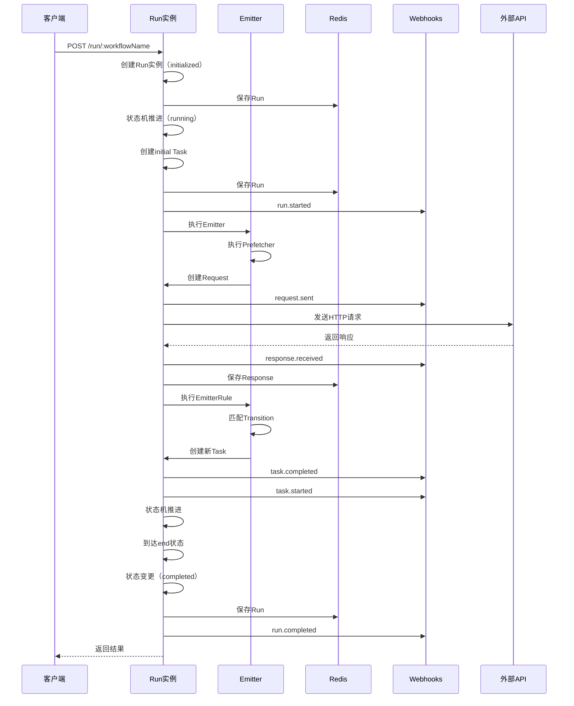

# Engine 应用架构

## 概述

Engine是ES-Workflow的核心工作流引擎，负责工作流实例的生命周期管理和状态机推进。基于Node.js + Koa构建，运行在3000端口。

## 架构图



## 核心组件

### 1. Run（工作流实例）

**职责**：
- 工作流实例生命周期管理
- 状态机推进逻辑
- Task创建与状态管理
- Request/Response处理

**状态机**：
```
initialized → running → completed
```

**核心方法**：
- `createTask()`: 创建任务
- `createRequests()`: 创建请求
- `sendRequest()`: 发送HTTP请求
- `nextTick()`: 状态机推进

**数据结构**：
```javascript
{
  id: ObjectId,
  workflowId: String,
  workflowName: String,
  status: 'initialized' | 'running' | 'completed',
  config: Workflow配置,
  tasks: [Task],
  inputParameters: Object,
  livingParameters: Object,
  outputParameters: Object,
  logs: [Log]
}
```

### 2. Emitter（发射器）

**职责**：
- 执行EmitterRule脚本
- 触发状态迁移
- 创建新Task

**执行流程**：
1. 获取Task的Emitter配置
2. 执行所有EmitterRule
3. 根据Rule结果触发Transition
4. 创建目标状态的Task

**脚本上下文**：
```javascript
{
  task,           // 当前任务
  request,        // 当前请求
  response,       // 响应数据
  dayjs,          // 日期处理
  console         // 日志输出
}
```

### 3. Prefetcher（预取器）

**职责**：
- 在Task创建前预取数据
- 丰富Task的inputParameters

**执行时机**：
- Task创建之前
- 可以调用外部API获取数据

**脚本上下文**：
```javascript
{
  task,           // 任务信息
  api,            // HTTP客户端
  dayjs,          // 日期处理
  console         // 日志输出
}
```

### 4. Webhooks（事件通知）

**职责**：
- 发送工作流事件到Triggers服务

**支持的事件**：
- `run.started`: 工作流开始
- `run.completed`: 工作流完成
- `task.started`: 任务开始
- `task.completed`: 任务完成
- `task.updated`: 任务更新
- `request.sent`: 请求发送
- `request.void`: 请求作废
- `response.received`: 响应接收

**配置方式**：
通过环境变量配置webhook地址：
```bash
WEBHOOK_RUN_STARTED=http://localhost:4243/hook/engine-run-started-listener
WEBHOOK_RUN_COMPLETED=http://localhost:4243/hook/engine-run-completed-listener
...
```

## 数据源插件

### CAC DataSource

**职责**：
- 从CAC服务读取Emitter配置
- 读取EmitterRule配置
- 读取Prefetcher配置

**配置**：
```bash
CONFIGS_DATASOURCE=cac
CAC_API=http://localhost:4242
```

### Redis DataSource

**职责**：
- 存储Run实例数据
- 存储Task数据
- 存储Request/Response数据
- 存储运行日志

**配置**：
```bash
REDIS_URL=redis://localhost
```

## API路由

### Workflow API
- `GET /workflow/:name` - 获取工作流配置
- `PUT /workflow/:name` - 保存工作流配置
- `DELETE /workflow/:name` - 删除工作流配置

### Run API
- `POST /run/:workflowName` - 创建并启动工作流实例
- `GET /run/:id` - 获取工作流实例详情
- `GET /run/:id/logs` - 获取工作流运行日志

### Emitter API
- `GET /emitter/:name` - 获取Emitter配置
- `PUT /emitter/:name` - 保存Emitter配置

### EmitterRule API
- `GET /emitter-rules/:name` - 获取EmitterRule配置
- `PUT /emitter-rules/:name` - 保存EmitterRule配置

### Prefetcher API
- `GET /prefetcher/:name` - 获取Prefetcher配置
- `PUT /prefetcher/:name` - 保存Prefetcher配置

## 工作流执行流程



## 关键设计

### 1. 状态机模式
Run实例使用状态机模式管理生命周期，通过`nextTick()`方法推进状态。

### 2. 事件驱动
通过Webhooks机制将运行事件发送到Triggers服务，实现解耦和可观测性。

### 3. 插件化数据源
通过DataSource接口抽象数据访问，支持CAC和Redis两种数据源。

### 4. 脚本化配置
Emitter、EmitterRule、Prefetcher都支持JavaScript脚本，提供灵活的业务逻辑定制能力。

### 5. 异步执行
所有外部调用（API请求、Webhook通知）都是异步执行，不阻塞状态机推进。

## 技术栈

- **框架**: Koa (koa-es-template)
- **语言**: ES Modules
- **HTTP客户端**: es-fetch-api
- **日期处理**: dayjs
- **ID生成**: es-object-id
- **日志**: koa-es-template logger
- **Redis**: es-ioredis-url

## 配置示例

### .env.local
```bash
# Redis配置
REDIS_URL=redis://localhost

# 配置数据源
CONFIGS_DATASOURCE=cac
CAC_API=http://localhost:4242

# Webhook配置
WEBHOOK_RUN_STARTED=http://localhost:4243/hook/engine-run-started-listener
WEBHOOK_RUN_COMPLETED=http://localhost:4243/hook/engine-run-completed-listener
WEBHOOK_TASK_STARTED=http://localhost:4243/hook/engine-task-started-listener
WEBHOOK_TASK_COMPLETED=http://localhost:4243/hook/engine-task-completed-listener
WEBHOOK_REQUEST_SENT=http://localhost:4243/hook/engine-request-sent-listener
WEBHOOK_REQUEST_VOID=http://localhost:4243/hook/engine-request-void-listener
WEBHOOK_RESPONSE_RECEIVED=http://localhost:4243/hook/engine-response-received-listener
WEBHOOK_TASK_UPDATED=http://localhost:4243/hook/engine-task-updated-listener
```

## 目录结构

```
engine/
├── src/
│   ├── core/              # 核心业务逻辑
│   │   ├── run.js         # Run实例管理
│   │   ├── emitter.js     # Emitter执行
│   │   ├── prefetcher.js  # Prefetcher执行
│   │   └── webhooks.js    # Webhook通知
│   ├── plugins/           # 插件
│   │   └── data-source/   # 数据源插件
│   │       ├── cac/       # CAC数据源
│   │       └── redis/     # Redis数据源
│   ├── routes/            # API路由
│   │   ├── workflow.js    # 工作流API
│   │   ├── run.js         # 运行API
│   │   ├── emitter.js     # Emitter API
│   │   ├── emitter-rules.js # EmitterRule API
│   │   └── prefetcher.js  # Prefetcher API
│   ├── utils/             # 工具函数
│   └── index.js           # 应用入口
└── .env.local             # 环境配置
```
