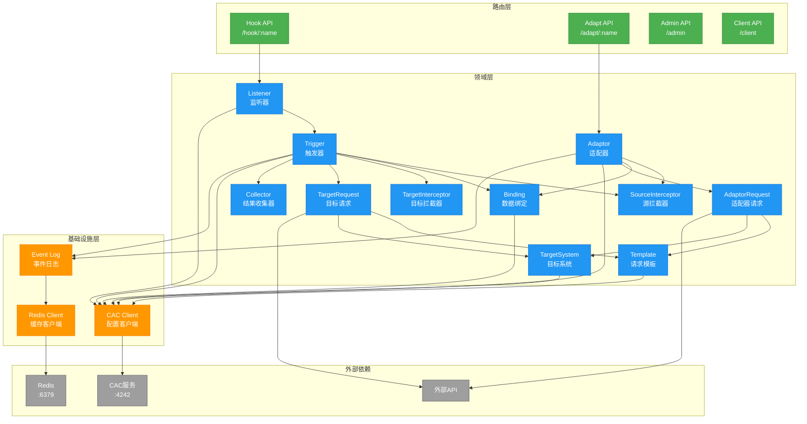
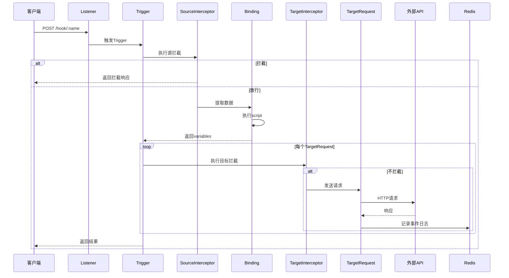
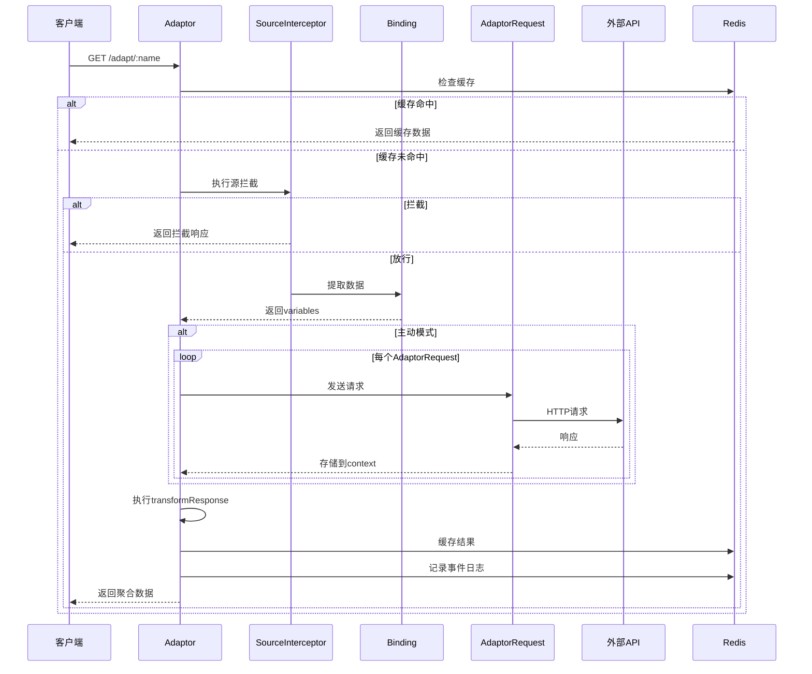

# Triggers 应用架构

## 概述

Triggers是ES-Workflow的HTTP请求转发服务，负责接收、转换和分发HTTP请求。基于Node.js + Koa构建，运行在4243端口。支持请求拦截、数据提取、模板转换、多目标分发和数据聚合等功能。

## 架构图



## 核心组件

### 1. Listener（监听器）

**职责**：
- 定义HTTP请求入口
- 关联一个或多个Trigger

**配置示例**：
```yaml
kind: listener
name: github-webhook-listener
metadata:
  title: GitHub Webhook监听器
spec:
  triggers:
    - github-push-trigger
    - github-pr-trigger
```

**访问路径**：`POST /hook/github-webhook-listener`

### 2. Trigger（触发器）

**职责**：
- 串联完整的请求转发流程
- 协调各个组件执行

**执行流程**：
```
SourceInterceptor → Binding → TargetInterceptor → TargetRequest → Collector
```

**配置示例**：
```yaml
kind: trigger
name: github-push-trigger
metadata:
  title: GitHub Push触发器
spec:
  sourceInterceptor: github-event-filter
  targetInterceptor: never-intercept
  binding: github-webhook-binding
  template: deploy-template
  targetSystem: deploy-api
```

### 3. Adaptor（适配器）

**职责**：
- 聚合多个数据源
- 转换和组合响应数据
- 支持缓存和被动模式

**两种模式**：
- **主动模式**：接收请求后主动调用AdaptorRequest获取数据
- **被动模式**：仅执行transformResponse脚本，不发送请求

**配置示例**：
```yaml
kind: adaptor
name: user-dashboard-adaptor
metadata:
  title: 用户仪表板数据聚合
spec:
  sourceInterceptor: auth-check
  adaptorRequests:
    - user-profile-request
    - user-stats-request
  transformResponse: |
    return {
      user: context.responses['user-profile-request'],
      stats: context.responses['user-stats-request']
    };
  outputCache:
    enabled: true
    ttl: 300
```

**访问路径**：`GET /adapt/user-dashboard-adaptor`

### 4. Binding（数据绑定）

**职责**：
- 从请求中提取数据
- 转换为variables对象
- 支持per-request脚本

**脚本上下文**：
```javascript
{
  headers,        // 请求头
  query,          // 查询参数
  body,           // 请求体
  variables,      // 变量对象（输出）
  dayjs,          // 日期处理
  console         // 日志输出
}
```

**配置示例**：
```yaml
kind: binding
name: github-webhook-binding
metadata:
  title: GitHub Webhook数据绑定
spec:
  script: |
    variables.EVENT_TYPE = headers['x-github-event'];
    variables.REPO_NAME = body.repository?.name || '';
    variables.BRANCH = body.ref?.replace('refs/heads/', '') || '';
    variables.COMMIT_SHA = body.after || '';
    variables['@'] = query.env || 'production';
```

### 5. SourceInterceptor（源拦截器）

**职责**：
- 判断是否应该触发转发
- 返回true表示拦截（不转发）
- 返回false表示放行（继续转发）

**配置示例**：
```yaml
kind: source-interceptor
name: github-event-filter
metadata:
  title: GitHub事件过滤器
spec:
  script: |
    const allowedEvents = ['push', 'pull_request'];
    const event = headers['x-github-event'];
    return !allowedEvents.includes(event);
```

### 6. TargetInterceptor（目标拦截器）

**职责**：
- 判断是否应该发送特定的TargetRequest
- 返回true表示拦截（不发送）
- 返回false表示放行（发送）

**配置示例**：
```yaml
kind: target-interceptor
name: production-only
metadata:
  title: 仅生产环境
spec:
  script: |
    return variables['@'] !== 'production';
```

### 7. Template（请求模板）

**职责**：
- 定义输出请求的格式
- 支持变量替换

**支持的变量格式**：
- `$VAR$`: 字符串替换
- `$@VAR$`: URL编码
- `$...VAR$`: 对象展开
- `$(Number)VAR$`: 数字类型
- `$(Boolean)VAR$`: 布尔类型

**配置示例**：
```yaml
kind: template
name: deploy-template
metadata:
  title: 部署请求模板
spec:
  path: /deploy
  method: POST
  format: json
  headers:
    Content-Type: application/json
    X-Event-Type: $EVENT_TYPE$
  body:
    repo: $REPO_NAME$
    branch: $BRANCH$
    commit: $COMMIT_SHA$
```

### 8. TargetSystem（目标系统）

**职责**：
- 定义目标API的地址
- 支持多环境配置

**配置示例**：
```yaml
kind: target-system
name: deploy-api
metadata:
  title: 部署API
spec:
  default: https://deploy.example.com
  production: https://deploy.prod.example.com
  staging: https://deploy.staging.example.com
  development: http://localhost:8080
```

**环境选择**：通过`variables['@']`选择环境

### 9. TargetRequest（目标请求）

**职责**：
- 组合Binding、Template、TargetSystem
- 执行实际的HTTP请求
- 错误跟踪和响应处理

**配置示例**：
```yaml
kind: target-request
name: deploy-request
metadata:
  title: 部署请求
spec:
  props:
    trigger: github-push-trigger
    binding: github-webhook-binding
    template: deploy-template
    targetSystem: deploy-api
  errorTracking:
    enabled: true
    eventName: deploy-failed
  postResponseScript: |
    console.log('Deploy response:', response?.status);
```

### 10. AdaptorRequest（适配器请求）

**职责**：
- 在Adaptor中定义单个数据请求
- 与TargetRequest类似，但用于数据聚合场景

**配置示例**：
```yaml
kind: adaptor-request
name: user-profile-request
metadata:
  title: 用户资料请求
spec:
  binding: user-binding
  template: user-profile-template
  targetSystem: user-api
```

### 11. TargetRequestsCollector（结果收集器）

**职责**：
- 收集所有TargetRequest的响应
- 处理和转换结果

**配置示例**：
```yaml
kind: target-requests-collector
name: deploy-collector
metadata:
  title: 部署结果收集器
spec:
  script: |
    const results = context.responses;
    return {
      success: Object.values(results).every(r => r.ok),
      details: results
    };
```

## 请求处理流程

### Trigger流程



### Adaptor流程



## API路由

### Hook API
- `POST /hook/:listenerName` - 触发Listener，执行关联的Trigger

### Adapt API
- `GET /adapt/:adaptorName` - 调用Adaptor，获取聚合数据

### Admin API
- `GET /admin/events` - 查询事件日志
- `GET /admin/triggers` - 查询Trigger列表

### Client API
- `GET /client/triggers` - 获取Trigger配置
- `GET /client/target-request-groups` - 获取TargetRequest分组

## 事件日志

Triggers会将所有重要事件记录到Redis，包括：

**事件类型**：
- `listener.invoked`: Listener被调用
- `trigger.invoked`: Trigger被触发
- `adaptor.invoked`: Adaptor被调用
- `source-request.intercepted`: 源请求被拦截
- `target-request.intercepted`: 目标请求被拦截
- `target-system.responded`: 目标系统响应
- `adaptor.output-cache-hit`: Adaptor缓存命中
- 各种内部错误事件

**日志结构**：
```javascript
{
  eventType: String,
  timestamp: Number,
  listenerName: String,
  triggerName: String,
  variables: Object,
  response: Object,
  error: Object
}
```

## 配置管理

### 配置文件路径
所有配置文件存储在项目根目录的`cac-configs`目录下：

```
cac-configs/
├── listener/
│   └── *.yaml
├── trigger/
│   └── *.yaml
├── adaptor/
│   └── *.yaml
├── binding/
│   └── *.yaml
├── source-interceptor/
│   └── *.yaml
├── target-interceptor/
│   └── *.yaml
├── template/
│   └── *.yaml
├── target-system/
│   └── *.yaml
├── target-request/
│   └── *.yaml
├── adaptor-request/
│   └── *.yaml
└── target-requests-collector/
    └── *.yaml
```

### 命名规范
- **配置名称**: kebab-case（如：`github-webhook-listener`）
- **变量名称**: UPPER_SNAKE_CASE（如：`USER_ID`）
- **特殊变量**: `@`（环境选择器）、`~`（默认namespace）

## 关键设计

### 1. 管道过滤器模式
请求处理流程采用管道模式，每个组件负责特定的转换步骤。

### 2. 策略模式
通过脚本化配置实现灵活的业务逻辑定制。

### 3. 适配器模式
Adaptor组件实现多数据源聚合和转换。

### 4. 缓存优先
Adaptor支持输出缓存，减少重复请求。

### 5. 事件驱动
所有操作都会产生事件日志，便于监控和调试。

### 6. 配置即代码
所有配置通过YAML文件管理，存储在Git仓库中。

## 技术栈

- **框架**: Koa (koa-es-template)
- **语言**: ES Modules
- **配置客户端**: cac-client
- **HTTP客户端**: es-fetch-api
- **日期处理**: dayjs
- **Redis**: es-ioredis-url
- **YAML**: yaml

## 配置示例

### .env
```bash
# Redis配置
REDIS_URL=redis://localhost

# CAC配置
CAC_API=http://localhost:4242

# 服务端口
PORT=4243
```

## 目录结构

```
triggers/
├── src/
│   ├── core/
│   │   ├── domain/              # 领域模型
│   │   │   ├── events/          # 领域事件
│   │   │   ├── listener.js      # Listener
│   │   │   ├── trigger.js       # Trigger
│   │   │   ├── adaptor.js       # Adaptor
│   │   │   ├── binding.js       # Binding
│   │   │   ├── source-interceptor.js
│   │   │   ├── target-interceptor.js
│   │   │   ├── template.js      # Template
│   │   │   ├── target-system.js # TargetSystem
│   │   │   ├── target-request.js
│   │   │   ├── adaptor-request.js
│   │   │   └── target-requests-collector.js
│   │   └── infrastructure/      # 基础设施
│   │       └── cac/
│   │           └── client.js    # CAC客户端
│   ├── routes/                  # API路由
│   │   ├── hook.js              # Hook API
│   │   ├── adapt.js             # Adapt API
│   │   ├── admin-api/           # Admin API
│   │   └── client-api/          # Client API
│   ├── utils/                   # 工具函数
│   └── index.js                 # 应用入口
└── .env                         # 环境配置
```
