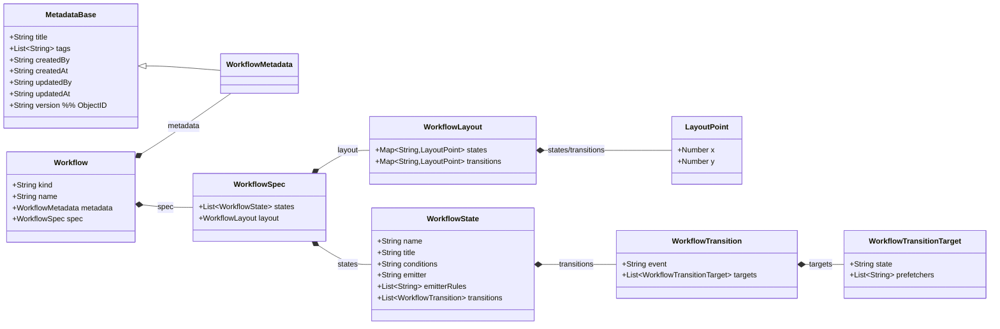

# 配置域（静态模型）— Workflow 配置（初稿）

> 目标：先建立“工作流配置模型”的最小骨架。按你的要求，当前阶段**只创建一个类：Workflow**，并先将配置结构统一为 4 个字段：`kind、name、metadata、spec`。  
> 后续再继续细化 `metadata/spec` 的内部字段与约束。

## 聚合与边界（当前假设）
- 聚合根候选：`Workflow`
- 一句话职责：承载一份工作流的“配置声明”（声明式结构），作为后续运行与演进的来源。

---

## 领域类图（Mermaid）



### 字段与行为说明（可讨论）
- `kind`：配置类型标识（**固定为 `"workflow"`**）。
- `name`：工作流配置名称（采用 path 方式命名，使用 `/` 分隔多层级；约束见下方）。
- `metadata`：工作流元数据（已开始细化，见下方）。
- `spec`：规格说明（**必填**），用于定义“以状态为节点、以事件触发迁移”的有向有环图（见下方）。

---

## metadata（已确认字段）

> 说明：`metadata` 作为值对象（Value Object）对待；当字段变化时，通常视为“替换”而不是“就地修改”（实现策略后续再定）。

### 字段
1. `title`：标题/显示名称，**必填**
2. `tags`：标签列表，可选  
   - 单个标签格式：`"<类型>/<值>"`
3. `createdBy`：创建人，可选
4. `createdAt`：创建日期，可选
5. `updatedBy`：最后更新人，可选
6. `updatedAt`：最后更新日期，可选
7. `version`：版本标识，可选（**ObjectID**）

### tags 约束（草案）
- 建议整体正则：`^[^/]+\/[^/]+$`（必须且仅包含一个 `/` 分隔）
- 是否允许空格、中文、更多层级分隔符：待你后续确认

### 时间格式（已确认）
- `createdAt/updatedAt`：字符串，UTC 时间
- 格式：`YYYY-MM-DD HH:mm:ss`

### version（ObjectID，已确认）
- 类型：MongoDB ObjectId（24 位十六进制字符串）
- 参考正则：`^[a-f0-9]{24}$`

---

## spec（必填，初稿：状态机图）

> 建模依据：工作流应当是一个**有向有环图**，在运行中表现为一个**状态机**：  
> - **状态（state）**作为节点  
> - **事件（event）**触发状态迁移  
> - 同一事件可能激活多个后续状态（一次迁移可 fan-out 到多个 `toStates`）

### 结构（当前最小模型）
- `states`：状态集合（状态名唯一性、是否允许复用/别名，待你后续确认）
  - `state.conditions`：启动条件脚本（可选），用于运行期“任务门控”（见下方两段式语义）
  - `state.emitter`：状态级 emitter 标识（可选）  
    - 语义：定义该 state 对外暴露的可执行操作集合（allowedActions），并作为该 state 的“业务场景 emitter”标识
    - 引用：指向独立配置域 `WorkflowStateEmitter.name`（见 `15-emitter-domain.md`）
  - `state.emitterRules`：状态级 emitter-rule 引用列表（可选，**有序**）  
    - 语义：
      - 常规 state：当该 state 的 Task 收到 response 时，引擎按顺序依次执行这些规则；第一条返回内部事件名的规则生效并短路
      - `initial`：在创建 `initial` 的 Task 后，引擎可作为系统调用执行一次规则链（例如 `auto-start`）以产出 `start` 事件
    - 命名约定：每个元素为 **ruleKey**（不含前缀）；引擎拼接得到 `EmitterRule.name`：`<state.emitter>/<ruleKey>`（以 `/` 分隔，见 `16-emitter-rule-domain.md`）
  - `state.transitions`：该状态的**外发迁移**集合（邻接表表达）
    - `event`：触发事件名
    - `targets`：目标状态列表（允许多个）
      - `state`：目标状态（引用状态的 `name`）
      - `prefetchers`：预取器标识列表（可选），用于在任务门控/处理前获取数据；此处为**引用**：指向独立配置域 `Prefetcher.name`（见 `12-prefetcher-domain.md`）
- `layout`：流程布局信息（可选，仅用于前端/UI 展示，不参与运行语义）
  - `layout.states`：节点坐标字典，key 为 `state.name`，value 为 `{x,y}`
  - `layout.transitions`：连线坐标字典，key 为 `<fromState>::<event>`，value 为 `{x,y}`

### 约束（草案，待确认）
1. `states` 至少包含 1 个状态
2. 每个 `state.transitions[*].targets[*].state` 必须存在于 `states`（引用有效性）
3. `targets` 允许多个；是否允许为空（表示终止）待定
4. **同一 `state` 下，`transition.event` 不允许重复**（即 `state.transitions[*].event` 唯一）
5. **同一 `transition` 下，`targets[*].state` 不允许重复**（即一次 fan-out 激活的目标状态集合去重）
6. **同一 `target` 下，`prefetchers[*]` 不允许重复**（同一 prefetcher 不应被重复执行）
7. **若某 state 配置了 `conditions`，则该 state 必须存在一条 `transition.event="ignored"` 的迁移**（用于条件不通过时的统一推进路径）
8. **若配置了 `spec.layout`**（建议校验）：
   - `layout.states` 中的 key 必须存在于 `spec.states[*].name`
   - `layout.transitions` 中的 key 必须能解析为 `<fromState>::<event>`，并且该迁移在配置中存在
9. **除结束状态（`end`）外，其他所有状态必须配置 `emitter`，且 `emitterRules` 至少包含 1 个 ruleKey**（用于将外部响应/系统调用归一为内部事件）
10. **请求目标约束（用于 request/response 驱动模型）**：对任一 `transition.targets[*]`，若其 `target.state != "end"`，则 `target.prefetchers` 至少包含 1 个“会产出 `TMP_REQUEST_TARGETS` 参数”的 prefetcher
   - 判定方式：该 prefetcher 的配置中 `spec.parameters` 包含 `TMP_REQUEST_TARGETS`（见 `12-prefetcher-domain.md`）
   - 含义：进入非 end 状态前必须准备好 request 目标列表，从而在 Task 进入 `in-progress` 时能生成 requests（见 ADR-018）
11. **可达性约束（静态图校验）**（在忽略事件触发条件的静态图上做校验）
   - 定义有向图：节点为 `spec.states[*].name`；若存在任一 `transition.targets[*].state = B`，则认为从 A 到 B 有一条边
   - 约束A（从 initial 可达）：对任一状态 `S != initial`，在该图上必须存在从 `initial` 到 `S` 的路径（避免存在永远不可达的“孤岛节点”）
   - 约束B（可达 end）：对任一状态 `S != end`，在该图上必须存在从 `S` 到 `end` 的路径（允许环路/自循环，但环路必须有通向 `end` 的出口，避免“闭环孤岛”导致运行永远无法结束）
   - 推论：该约束在图论意义上已经蕴含“非 initial 状态至少有入边、非 end 状态至少有出边”，因此无需重复声明
12. 初始状态约定：必须存在且仅存在一个保留状态 `name="initial"`，并且该状态**用户不可删除、不可修改**（由系统保留）
13. 结束状态约定：必须存在且仅存在一个保留状态 `name="end"`，并且该状态**用户不可删除、不可修改**（由系统保留）
14. **强制约束：开始/结束状态的迁移规则**
   - 开始状态（`initial`）**只能出不能入**：任何 `target.state` 不允许指向 `initial`
   - 开始状态（`initial`）的所有外发迁移，其 `event` **必须等于** `"start"`
   - 开始状态（`initial`）**至少有 1 个外发迁移**
   - 开始状态（`initial`）**不允许配置任何 `conditions`**（必须为空或不存在）
   - 结束状态（`end`）**只能进不能出**：`end.transitions` 必须为空（或不存在）
   - 结束状态（`end`）**不允许配置任何 `conditions`**（必须为空或不存在）
15. **强制约束：开始/结束状态的运行期语义**
   - `initial`：其 Task **创建即完成**，并通过系统调用执行一次 emitterRules 产出事件 `"start"`（用于进入后续状态；默认可用 `system/start/auto-start`）
   - `end`：其 Task **创建即完成**，并驱动 WorkflowRun 结束（Completed）

### 迁移与条件（仅保留 State.conditions）
- 迁移（transition）只负责描述：在某个 `event` 下，激活哪些目标状态（`targets` 可 fan-out 多个）。
- 启动条件（condition）仅保留在 `WorkflowState.conditions` 上：
  - 状态被激活后会创建 Task（初始 `initialized`）
  - 引擎执行 `state.conditions`：
    - 满足：Task 进入 `in-progress`
    - 不满足：Task 进入 `ignored`，并**统一触发内部事件 `"ignored"`**

> 注：若需要“跳过某些 states”的效果，可通过：  
> 1) 仍然激活该 state；2) 让其 `state.conditions` 不通过从而 Ignored；3) 通过该 state 的 `transition.event="ignored"` 驱动绕行/汇合。

### 启动条件（已确认：用于运行期 Task 管控）
> 说明：当前版本仅保留 `state.conditions`（脚本），用于决定任务是否进入处理态。

**state.conditions（门控脚本）**  
- `conditions` 仅填写 **content**（函数体内容）。运行时会将其包装为：
  ```js
  async (run, task, parameters, api) => {
    const result = { pass: true };
    // content...
    return result;
  }
  ```
- 其中 `parameters` 为“参数合并视图”（建议实现）：`run.livingParameters` 与 `task.livingParameters` 的合并（同名 key 冲突时以 task 优先，策略可再定）
- 约定：
  - `result.pass === true`：Task 进入 `in-progress`
  - `result.pass === false`：Task 置为 `Ignored`，并统一触发内部事件 `"ignored"`（要求存在对应迁移）

---

## 约束：kind / name（已确认）

### kind
- 必须等于：`"workflow"`（全小写）。

### name（path 命名）
- 形式：`segment/segment/...`
- 分隔符：`/`
- 每个 `segment` 的字符集：仅允许 `a-z`、`0-9`、`-`
- `-` 不允许出现在 `segment` 的首尾

**参考正则（段级）**
- `segment`: `^[a-z0-9]+(-[a-z0-9]+)*$`

**参考正则（整体）**
- `name`: `^[a-z0-9]+(-[a-z0-9]+)*(\\/[a-z0-9]+(-[a-z0-9]+)*)*$`

---

## 后续扩展点（占位，待你确认后补齐）
- 配置版本：除 `metadata.version` 外，是否还需要“spec 级版本/发布版本”等独立概念。
- 配置生命周期：是否需要 `status`（如 Draft/Published/Archived），以及它应处于 `metadata/status` 还是独立字段。
- 当引入 `status` 后，再补充对应**状态机**与**领域规则**。

---
## 参数命名与类型规则（已确认）

> 适用范围：`WorkflowRun`/`WorkflowTask` 的 `inputParameters/livingParameters/outputParameters`，以及 `WorkflowEvent.payload`、`WorkflowRequest.payload` 等字符串字典。

1. **参数 key 命名规则**
   - 仅允许：大写字母 `A-Z`、数字 `0-9`、下划线 `_`
   - 分隔符：`_`
   - 首字符：不允许为数字
   - 末字符：不允许为下划线 `_`
   - 参考正则（允许 1 个字符）：`^[A-Z](?:[A-Z0-9_]*[A-Z0-9])?$`
2. **参数 value 类型规则**
   - 所有参数值统一为 **字符串（String）**

3. **临时参数（TMP_ 前缀，已确认）**
   - 约定：参数 key 若以 `TMP_` 开头，视为“临时参数”
   - 行为：任务结束时（Task 进入 Completed/Ignored）执行参数回写/合并时：
     - **不输出**：不进入 `task.outputParameters`
     - **不后传**：不合并到 `run.livingParameters`
