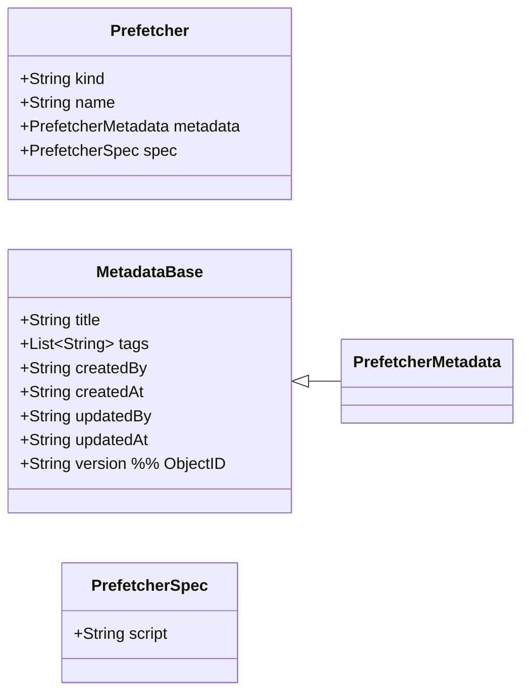

# Prefetcher 配置域（独立业务领域）— Prefetcher（初稿）

> 目标：为“预取器（Prefetcher）”建立独立的配置领域模型。  
> 说明：Prefetcher 与 Workflow/Emitter 一样，采用声明式配置结构：`kind / name / metadata / spec`。

---

## 领域对象（当前假设）
- 聚合根候选：`Prefetcher`
- 一句话职责：在工作流运行期，根据 run/task 上下文执行脚本以预取/派生数据，并写入运行期参数（通常写入 `run.livingParameters` 或 `task.livingParameters`，由引擎决定）。

---

## 领域类图（Mermaid）



---

## 字段说明（已确认 + 草案）

### kind（已确认）
- 固定为：`"prefetcher"`

### name（默认沿用 workflow 规则，若你要另定可再改）
- 采用 path 命名（`/` 分隔），每段仅允许 `a-z`、`0-9`、`-`（`-` 不在段首尾）

### metadata
- 使用 `PrefetcherMetadata`（继承自 `MetadataBase`：标题、tags、审计字段、版本 ObjectId 等）

### spec
- `script`：脚本文本（必填；运行时默认按 JavaScript 执行）  
  - 约定：`script` 仅填写 **content**（函数体内容）。运行时会将其包装为：
    ```js
    async (run, task, target, parameters, api) => {
      const result = {};
      // === script content begin ===
      /* ${content} */
      // === script content end ===
      return result;
    }
    ```
  - 返回值：必须返回 `result`（字符串字典），由引擎合并写入 `parameters`（通常为 `run.livingParameters` 或 `task.livingParameters`，实现可配置/约定）

---

## 与 Workflow 配置的关联（引用关系）

在 Workflow 的配置域中：
- `WorkflowTransitionTarget.prefetchers: List<String>` 作为**引用标识列表**，每个元素指向某个 `Prefetcher.name`

---

## 示例：生成 TMP_REQUEST_TARGETS（派单目标）

> 目的：在进入某个状态任务前，预先给该 Task 写入 `TMP_REQUEST_TARGETS`，从而在 Task 进入 `InProgress` 时自动生成 request 列表（见运行域 ADR-018）。

### Prefetcher 配置示例（YAML）
```yaml
kind: prefetcher
name: demo/request-targets
metadata:
  title: 生成请求目标列表
  tags:
    - demo/example
spec:
  script: |
    // 注意：这里仅填写 content，会被运行时包装进：
    // async (run, task, target, parameters, api) => { const result = {}; ...; return result }
    //
    // 参数命名规则：大写/数字/下划线，且不以_结尾；值为字符串
    // TMP_ 前缀参数：任务结束后不输出、不后传（适合作为预取临时上下文）

    // 最简示例：直接指定一个处理方
    result["TMP_REQUEST_TARGETS"] = "user:10086";
```

### 在 Workflow 中引用该 Prefetcher（片段示例）
```yaml
spec:
  states:
    - name: review
      title: 审核
      transitions:
        - event: start
          targets:
            - state: approve
              prefetchers:
                - demo/request-targets
```
