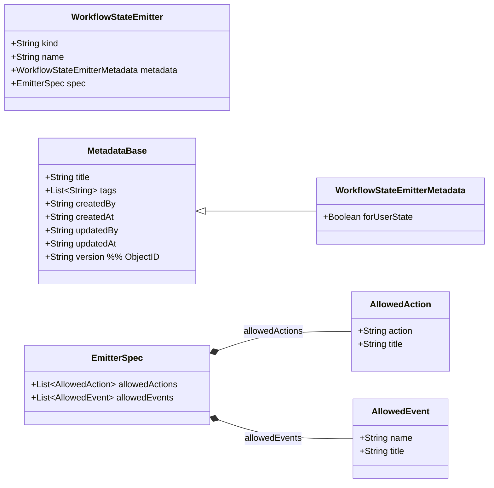

# Emitter 配置域（独立业务领域）— WorkflowStateEmitter（初稿）

> 目标：为“状态级事件触发策略（Emitter）”建立独立的配置领域模型。  
> 说明：Emitter 与 Workflow 一样，采用声明式配置结构：`kind / name / metadata / spec`。

---

## 领域对象（当前假设）
- 聚合根候选：`WorkflowStateEmitter`
- 一句话职责：定义一条可复用的“规则”：当某个 state 对应 Task 收到 response 后，是否产出**内部事件**推进状态机（脚本化）。

---

## 领域类图（Mermaid）



---

## 字段说明（草案）

### kind（已确认）
- 固定为：`"workflow-transition-emitter"`  
  - 说明：该 kind 名称为历史沿用，但当前语义按“状态级 emitter”使用。

### name（默认沿用 workflow 规则，若你要另定可再改）
- 采用 path 命名（`/` 分隔），每段仅允许 `a-z`、`0-9`、`-`（`-` 不在段首尾）

### metadata
- 使用 `WorkflowStateEmitterMetadata`（继承自 `MetadataBase`：标题、tags、审计字段、版本 ObjectId 等）
- `forUserState`（可选，默认 false）
  - 含义：标识该 emitter 是否允许被“用户新增的 state”选择/引用（用于 UI 过滤与治理）。
  - 示例：
    - `system/*` 这类系统内置 emitter：通常 `forUserState=false`
    - `demo/*` 或业务 emitter：通常 `forUserState=true`

### spec
Emitter 的职责是“定义可执行操作清单”，触发判定通过独立的 `EmitterRule` 完成（见 `16-emitter-rule-domain.md`）。

`allowedActions`（可选，建议配置）
- 含义：对外暴露的“可执行操作”集合（即第三方可提交的 `response.action`），并为每个操作提供显示名称
- 结构：
  - `action`：操作标识（将写入 `response.action`）
  - `title`：显示名称（用于 UI 展示）
- 第三方可通过 `runId + taskId` 获取当前任务对应 state 的 emitter，读取该字段作为可执行操作清单

`allowedEvents`（可选，建议配置）
- 含义：声明该 emitter 在其规则链（`EmitterRule`）执行后**可能产出的内部事件集合**，并为每个事件提供显示名称（用于 UI 展示/编排校验）。
- 结构：
  - `name`：内部事件名（对应 `transition.event`，例如 `passed` / `rejected`）
  - `title`：显示名称（用于 UI 展示）
- 约束建议：
  - `allowedEvents[*].name` 在同一 emitter 内不重复
  - 规则链产出的 `event.name` 应属于该集合（校验策略由实现决定）
  - 注：条件门控不通过时引擎统一触发的 `ignored` 事件属于“引擎事件”，可选择是否也纳入 `allowedEvents`（若纳入则建议所有 emitter 统一包含）

---

## 与 Workflow 配置的关联（引用关系）

在 Workflow 的配置域中：
- `WorkflowState.emitter` 作为**引用标识**，指向某个 `WorkflowStateEmitter.name`（用于声明 allowedActions）
- `WorkflowState.emitterRules[*]` 作为**规则 key 列表（有序）**；引擎拼接得到 `EmitterRule.name`：`<state.emitter>/<ruleKey>`（用于判定触发内部事件）

---

## 示例：一个审批场景 emitter（仅操作清单）

> 说明：
> - 下方 `spec.script` 均为 **content**（函数体内容），运行时会按本文档的统一函数签名包装。
> - 示例里假设 `task.requests` 中的每个 request 可能携带 `response`，可用于统计已收到的响应。

```yaml
kind: workflow-transition-emitter
name: demo/approval
metadata:
  title: 审批场景 emitter
  forUserState: true
spec:
  allowedActions:
    - action: ACCEPT
      title: 通过
    - action: REFUSE
      title: 拒绝
  allowedEvents:
    - name: passed
      title: 通过
    - name: rejected
      title: 拒绝
```

---

## 示例：开始节点 emitter（声明 start 事件）

> 说明：`initial` 状态的 Task 在运行期会“创建即完成”，并由引擎自动触发内部事件 `start`。  
> 该 emitter 的目的主要是：让编排/UI 能明确看到“开始节点会产出哪些事件及显示名称”（与其他 state 保持一致）。

```yaml
kind: workflow-transition-emitter
name: system/start
metadata:
  title: 开始节点 emitter
  forUserState: false
spec:
  allowedActions: []
  allowedEvents:
    - name: start
      title: 启动
```

> 配套规则：建议在 `initial` state 上配置 `emitterRules: [auto-start]`，对应规则 `system/start/auto-start`（见 `16-emitter-rule-domain.md`）。
