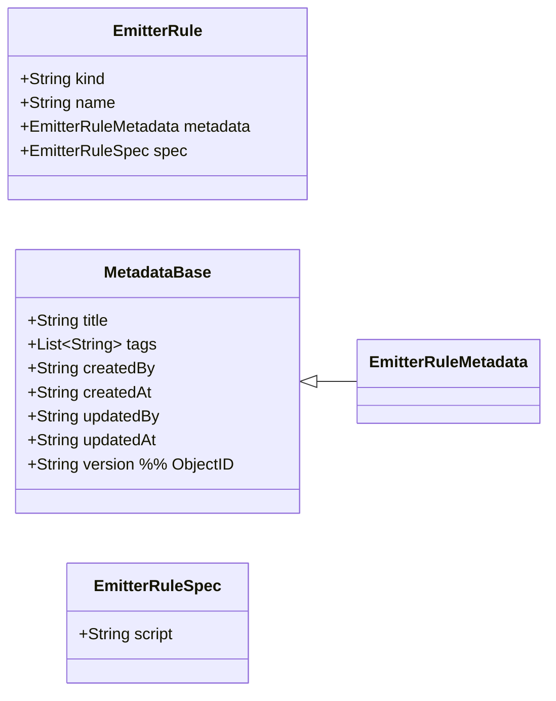

# EmitterRule 配置域（独立业务领域）— EmitterRule（初稿）

> 目标：将 emitter 的“可复用判定规则”抽为独立配置模型（一条规则一个配置），以支持在不同 workflow/state 间复用。

---

## 领域对象（当前假设）
- 聚合根候选：`EmitterRule`
- 一句话职责：在某个 state 的 Task 收到 response 时，执行脚本判定是否产出一个**内部事件名**（用于匹配 `transition.event`）。

---

## 领域类图（Mermaid）



---

## 字段说明（已确认 + 草案）

### kind（已确认）
- 固定为：`"emitter-rule"`

### name（已确认，约定）
- 命名约定：`<emitterName>/<ruleKey>`（以 `/` 分隔）
  - 其中 `emitterName` 来自 `WorkflowState.emitter`
  - `ruleKey` 来自 `WorkflowState.emitterRules[*]` 的元素值
  - 例如 state 配置：
    - `emitter: demo/approval`
    - `emitterRules: [veto, quorum-2]`
  - 则对应的规则 name 为：
    - `demo/approval/veto`
    - `demo/approval/quorum-2`

### spec.script（已确认）
- `script` 仅填写 **content**（函数体内容）。运行时会将其包装为：
  ```js
  async (run, task, request, parameters, api) => {
    const event = { name: null };
    // content...
    return event;
  }
  ```
- **建议**：规则判定逻辑尽量只依赖 `task.requests`（已累积的全量 request/responses 视图），避免依赖“本次触发的 request”，从而保证多规则组合时的可预期性与幂等性。
- response 过滤约定（新增）：
  - `WorkflowRequest.responses` 为日志，包含 `kind=decision/update-task`
  - 规则脚本应仅统计 `kind="decision"` 的 response（update-task 仅用于更新任务，不应影响事件判定）
  - 对 `status="voided"` 的 request，规则脚本通常应忽略（被作废的 request 不再参与统计）
- 返回值约定（已确认：仅 eventName）：
  - 返回对象 `event`，其中：
    - `event.name === null`：本规则不触发事件（继续执行下一条规则）
    - `event.name === "<eventName>"`：表示内部事件名（例如 `"passed"` / `"rejected"`），引擎将触发该事件并短路

---

## 示例：三条可复用规则（YAML）

### 规则1：一票否决（任意 REFUSE -> rejected）
```yaml
kind: emitter-rule
name: demo/approval/veto
metadata:
  title: 一票否决
spec:
  script: |
    // 任意人拒绝即拒绝（使用 task.requests 视图，避免依赖本次 request）
    const decisionActions = (task.requests ?? [])
      .filter(r => r?.status !== "voided")
      .map(r => (r?.responses ?? []).filter(x => x?.kind === "decision").at(-1)?.action)
      .filter(Boolean);

    if (decisionActions.some(a => a === "REFUSE")) event.name = "rejected";
```

### 规则2：有 1 人通过即通过（任意 ACCEPT -> passed）
```yaml
kind: emitter-rule
name: demo/approval/any-accept
metadata:
  title: 任一通过即通过
spec:
  script: |
    // 任意人通过即通过
    const decisionActions = (task.requests ?? [])
      .filter(r => r?.status !== "voided")
      .map(r => (r?.responses ?? []).filter(x => x?.kind === "decision").at(-1)?.action)
      .filter(Boolean);

    if (decisionActions.some(a => a === "ACCEPT")) event.name = "passed";
```

### 规则3：两人通过即通过（累计 >=2 个 ACCEPT -> passed）
```yaml
kind: emitter-rule
name: demo/approval/quorum-2
metadata:
  title: 两人通过即通过
spec:
  script: |
    const actions = (task.requests ?? [])
      .filter(r => r?.status !== "voided")
      .map(r => (r?.responses ?? []).filter(x => x?.kind === "decision").at(-1)?.action)
      .filter(Boolean);

    const acceptCount = actions.filter(a => a === "ACCEPT").length;
    if (acceptCount >= 2) event.name = "passed";
```

---

## 更多示例：一些可复用的规则片段

### 规则0：自动开始（无条件触发 start）
> 语义：用于 `initial` 状态，作为系统调用的规则（无需依赖 request/response）。
```yaml
kind: emitter-rule
name: system/start/auto-start
metadata:
  title: 自动开始
spec:
  script: |
    event.name = "start";
```

### 规则4：收齐响应后再根据多数通过（通过数 > 拒绝数 -> passed，否则 rejected）
> 语义：只有当所有 request 都有 response 时才判定；否则返回 null 继续等待。
```yaml
kind: emitter-rule
name: demo/approval/majority-after-all
metadata:
  title: 收齐后多数通过
spec:
  script: |
    const requests = (task.requests ?? []).filter(r => r?.status !== "voided");
    const decisions = requests
      .map(r => (r?.responses ?? []).filter(x => x?.kind === "decision").at(-1))
      .filter(Boolean);
    if (decisions.length < requests.length) return event;

    const acceptCount = decisions.filter(r => r.action === "ACCEPT").length;
    const refuseCount = decisions.filter(r => r.action === "REFUSE").length;

    event.name = (acceptCount > refuseCount) ? "passed" : "rejected";
```

### 规则5：超时自动通过（超过 DEADLINE_AT 且无人 REFUSE -> passed）
> 说明：假设 `parameters["DEADLINE_AT"]` 为 UTC 字符串（`YYYY-MM-DD HH:mm:ss`）。
```yaml
kind: emitter-rule
name: demo/approval/timeout-pass-no-refuse
metadata:
  title: 超时自动通过（无人拒绝）
spec:
  script: |
    const deadline = parameters["DEADLINE_AT"];
    if (!deadline) return event;

    const now = await api.nowUtc(); // 示例：实现注入
    if (now <= deadline) return event;

    const decisionActions = (task.requests ?? [])
      .filter(r => r?.status !== "voided")
      .map(r => (r?.responses ?? []).filter(x => x?.kind === "decision").at(-1)?.action)
      .filter(Boolean);
    if (decisionActions.some(a => a === "REFUSE")) return event;

    event.name = "passed";
```

### 规则6：指定 target 的响应才有效（仅 user:10086 的 ACCEPT -> passed）
> 语义：适合“指定审批人”场景；其他人的响应忽略。
```yaml
kind: emitter-rule
name: demo/approval/only-specific-target
metadata:
  title: 仅指定处理方有效
spec:
  script: |
    // 仅指定处理方有效：只看 target=user:10086 的响应（不依赖本次触发的 request）
    const req = (task.requests ?? []).find(r => r?.target === "user:10086" && (r?.responses ?? []).length > 0);
    if (!req) return event;
    const decision = (req.responses ?? []).filter(x => x?.kind === "decision").at(-1);
    if (!decision) return event;
    if (decision.action === "ACCEPT") event.name = "passed";
    if (decision.action === "REFUSE") event.name = "rejected";
```

### 规则7：幂等防抖（若已触发过 PASSED/REJECTED，则忽略后续 response）
> 说明：假设引擎会把已触发的事件名写入 `parameters["TMP_LAST_EVENT"]`（仅示例）。
```yaml
kind: emitter-rule
name: demo/approval/dedupe-terminal-event
metadata:
  title: 防止重复触发终态事件
spec:
  script: |
    const last = parameters["TMP_LAST_EVENT"];
    if (last === "passed" || last === "rejected") return event;

    // 本规则本身不做判定，只做“前置拦截”
    return event;
```
