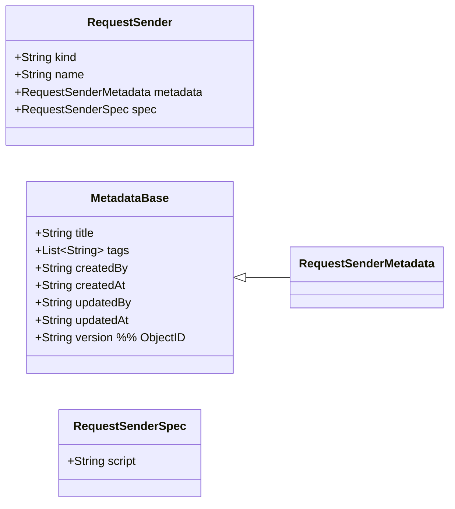

# RequestSender 配置域（独立业务领域）— RequestSender（初稿）

> 目标：为“请求发送器（RequestSender）”建立独立的配置领域模型。  
> 说明：RequestSender 与 Workflow/Emitter/Prefetcher 一样，采用声明式配置结构：`kind / name / metadata / spec`。

---

## 领域对象（当前假设）
- 聚合根候选：`RequestSender`
- 一句话职责：将运行期生成的 `WorkflowRequest` 投递到某个外部系统/通道（HTTP/MQ/IM/内部系统等），并返回发送回执/状态信息。

---

## 与 request target 的映射规则（强约束）
RequestSender 的检索键必须与 request target 表达式直接对应：
- request target 表达式：`<senderName>:<ref>`
- 映射规则：`senderName` **必须等于** `RequestSender.name`（严格一一对应）

示例：
- `user:10086` → 查找 `kind=request-sender, name=user`
- `http:https://example.com/hook` → 查找 `kind=request-sender, name=http`

> 说明：不引入 `spec.type` 字段，避免影响“配置即代码”的检索与落盘路径（以 `kind+name` 为主键）。

---

## 领域类图（Mermaid）



---

## 字段说明（草案）

### kind（已确认）
- 固定为：`"request-sender"`

### name（强约束）
- 采用单段 key 命名（不允许 `/`），建议仅允许 `a-z`、`0-9`、`-`
- 语义：同时作为 request target 的类型前缀（`<name>:<ref>`）

### spec.script（必填）
- 约定：`script` 仅填写 **content**（函数体内容）。运行时会将其包装为：
  ```js
  async (run, task, request, target, parameters, api) => {
    const result = { ok: true };
    // === script content begin ===
    /* ${content} */
    // === script content end ===
    return result;
  }
  ```
- 入参约定：
  - `target`：解析后的目标信息（至少包含 `name/ref/raw`；由引擎提供）
  - `parameters`：运行期参数视图（通常为 `task.livingParameters`；实现可决定）
  - `api`：引擎提供的受控能力（例如发 HTTP、发 MQ、写审计日志、读取密钥等；待你后续定义）
- 返回值（建议约定）：
  - `result.ok: boolean`：是否发送成功
  - 可选：`result.messageId / result.ticketId / result.detail` 等，用于写入 `request` 的回执字段或日志

---

## 运行期参与时机（关键）

在当前运行模型中，“发送”发生在 **WorkflowRequest 被创建之后、外部 response 被提交之前**：
1. 迁移激活某 state，创建 `WorkflowTask`
2. Task 进入 `in-progress`
3. 引擎根据 `TMP_REQUEST_TARGETS` 生成 `WorkflowRequest` 列表（见 ADR-018）
4. **对每条 WorkflowRequest：解析 request.target 得到 `<senderName>:<ref>`**
5. **加载对应 RequestSender（kind=request-sender,name=<senderName>），执行 `sender.spec.script` 完成投递**
6. 外部系统随后提交 `WorkflowResponse`（由 `state.emitterRules` 聚合产出内部事件，推进状态机）

> 说明：本模型中 RequestSender 只负责“怎么发送”，不负责“发给谁”；“发给谁”由 prefetcher 产出的 `TMP_REQUEST_TARGETS` 决定。

---

## 示例：HTTP 发送器（webhook）

```yaml
kind: request-sender
name: http
metadata:
  title: HTTP webhook 发送器
spec:
  script: |
    // target.ref 形如 "https://example.com/hook"
    // request.body/headers 的构造策略由实现决定；此处仅示意：
    //
    // const resp = await api.http.post(target.ref, { json: request.payload })
    // result.ok = resp.status >= 200 && resp.status < 300
    // result.messageId = resp.headers["x-request-id"]
```

