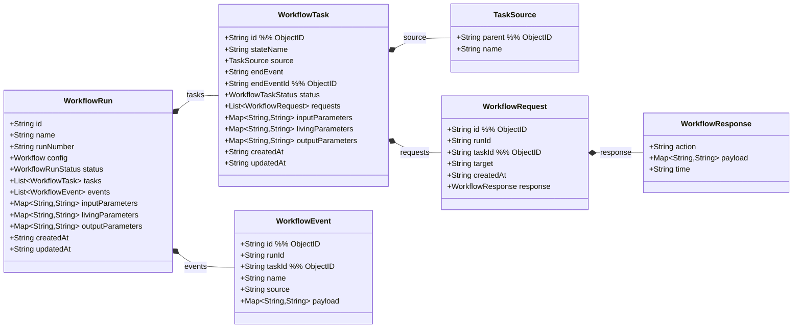
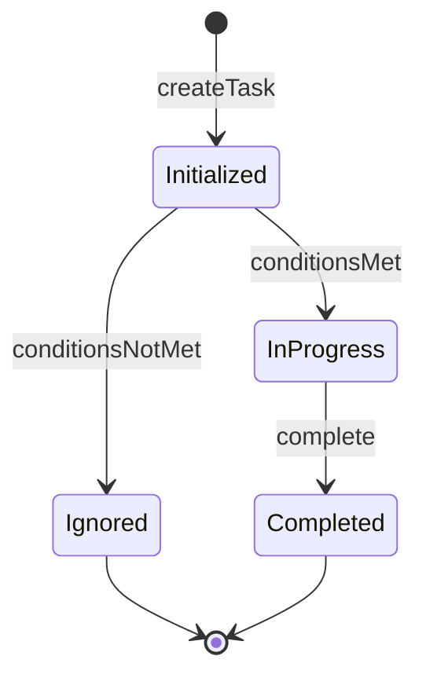
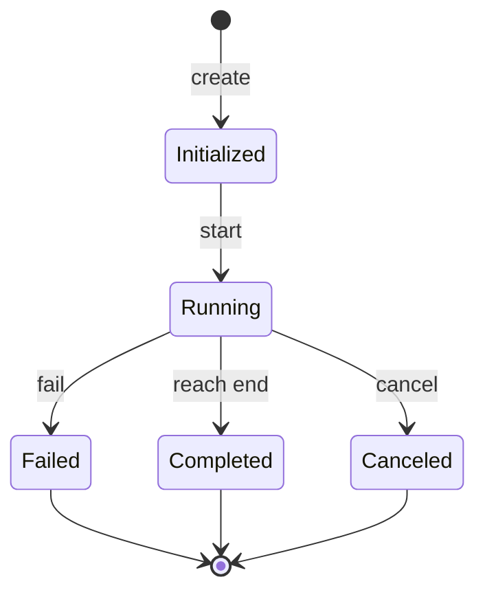
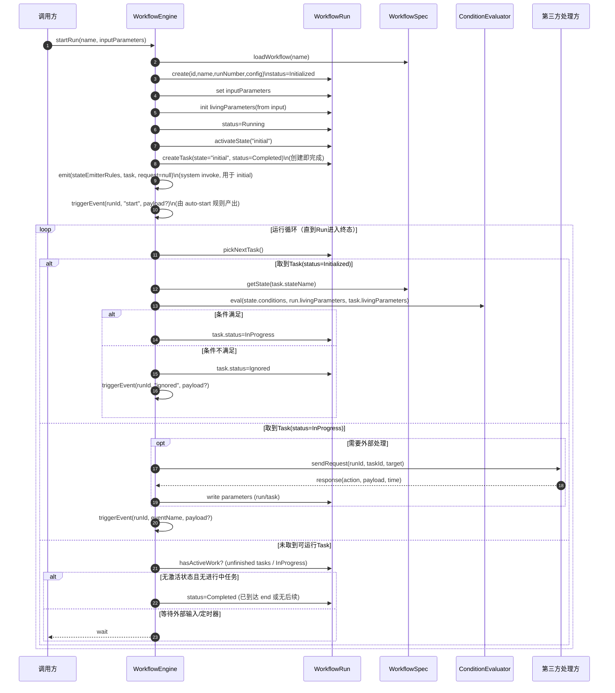
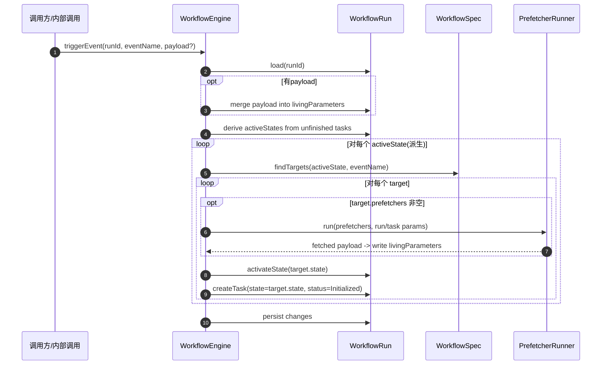
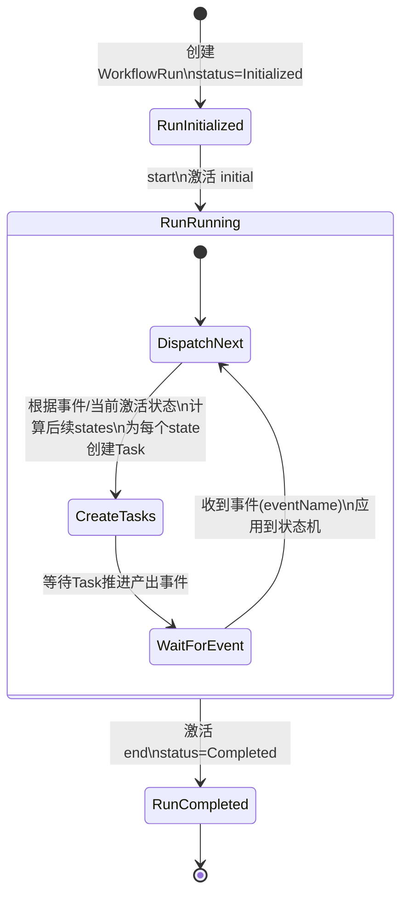
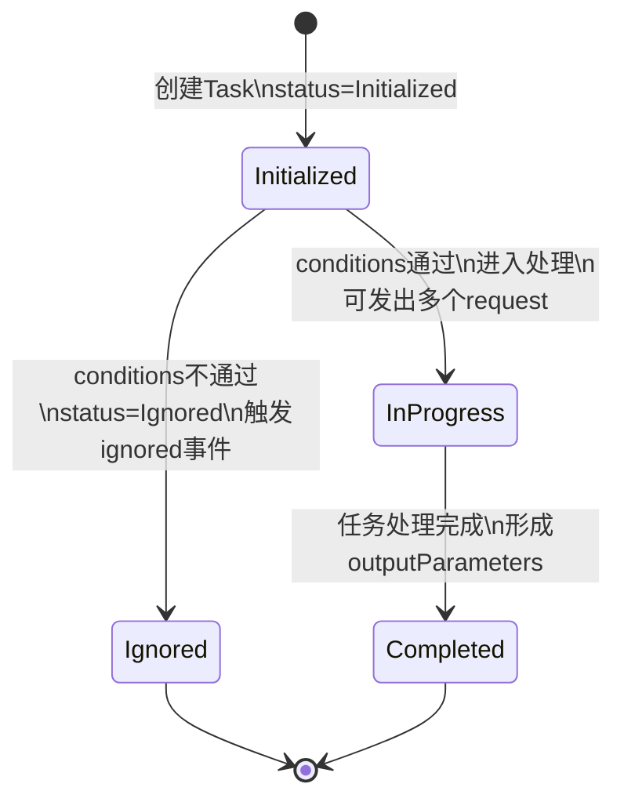
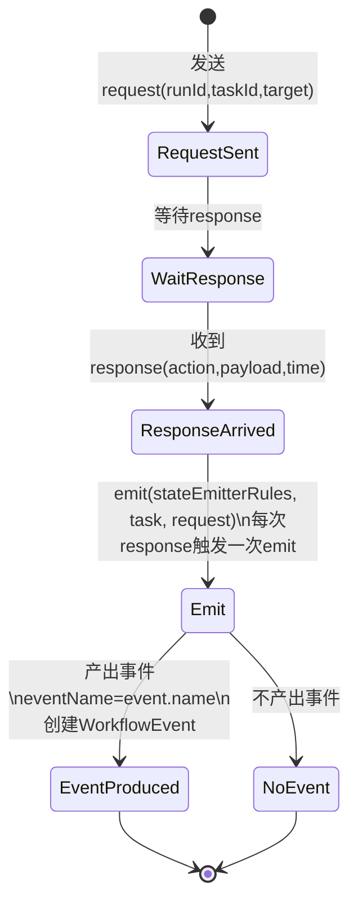

# 运行域（静态 + 动态）— WorkflowRun（第一步）

> 目标：从运行期核心概念 **WorkflowRun** 开始，逐步建立：  
> 1) 运行实例的静态模型（类图）  
> 2) 运行推进的动态模型（状态图/时序图）

本文件先完成 WorkflowRun 的第一版草案，后续再按你的确认继续扩展。

---

## 运行期静态模型：WorkflowRun（草案）

### 设计要点（来自你的约束）
1. `WorkflowRun.id` 需要具备信息密度：`<工作流标识>.<工作流运行编号>`
2. 其中工作流标识来自 `Workflow.name`，并将 `/` 替换为 `.`
3. 每条工作流的运行编号从 `1` 开始自增；不同工作流互不影响
4. 时间字段采用 UTC 字符串：`YYYY-MM-DD HH:mm:ss`
5. 参数 key 命名与 value 类型约束：见配置域文档的“参数命名与类型规则（已确认）”

### 领域类图（Mermaid）

### 字段说明（草案）
- `id`：`<workflowNameWithDots>.<runNumber>`
  - `workflowNameWithDots = name.replaceAll("/", ".")`
  - 示例：`order.approval.3`
- `name`：引用配置域 `Workflow.name`（path 形式）
- `runNumber`：该 `name` 下的自增序号（从 1 开始）
- `config`：创建该 WorkflowRun 时所使用的 Workflow 配置（快照/引用策略后续再定）
- `status`：运行状态（见下方状态机草案）
- `tasks`：任务列表（值对象）。每当某个状态被激活，会产生一个新的 Task（并行/汇合细节后续继续细化）
- `inputParameters`：输入参数（字符串字典）
- `livingParameters`：运行中参数（字符串字典）  
  - 约定：任一 Task 结束（Completed / Ignored）时，将 `task.outputParameters` 合并到 `run.livingParameters`
- `outputParameters`：输出参数（字符串字典）
- `createdAt/updatedAt`：UTC 字符串时间，格式 `YYYY-MM-DD HH:mm:ss`

---

## WorkflowTask（草案）

### 基本语义（已对齐）
1. Task 是运行期值对象（VO），由 WorkflowRun 持有 `tasks: List<WorkflowTask>`
2. 每当某个 **state 被激活**，都会产生一个新的 Task
3. Task 初始状态为 `initialized`
   - 若配置域 `WorkflowState.conditions` 通过：进入 `in-progress`
   - 若不通过：Task 进入 `Ignored`（自动终止的完成态），并统一触发内部事件 `ignored`
4. Task 也拥有三段式参数：
   - `inputParameters`：创建该 Task 时的输入参数（可来自 run.input/living 的快照，策略后续定）
   - `livingParameters`：Task 运行中的实时参数（仅开始后、结束前存在）
   - `outputParameters`：Task 结束后的结果参数（仅结束后存在）
5. **Task 结束时参数回写（已确认）**：
   - 任一 Task 进入终态（`Completed` / `Ignored`）时，将 `task.outputParameters` 合并到 `run.livingParameters`
6. **Task 进入 InProgress 时生成请求（已确认）**：
   - 若 `task.inputParameters` 中存在 `TMP_REQUEST_TARGETS`：
     - 将其值按英文逗号 `,` 分割为 target 列表（建议：trim 空格、忽略空项）
     - 为每个 target 创建一条 `WorkflowRequest`（写入 `task.requests`）
   - 若不存在该参数，则该 Task 默认不自动产生 request（是否仍可通过其他方式推进，后续再定）
7. **Task 的可追溯来源（新增）**：
   - `task.source.parent`：前序任务 id（ObjectId）。表示“是谁触发/推进到激活了本 state”
   - `task.source.name`：触发事件名（内部事件，即 `transition.event`，例如 `passed` / `rejected` / `b_skipped` / `start`）
   - 备注：`initial` 的 Task 可令 `source` 为空或由实现填充（例如 parent=null,name=null）
8. **Task 的结束事件（新增）**：
   - `task.endEvent`：Task 进入终态时记录的“结束事件名”（内部事件，即 `transition.event`）
   - `task.endEventId`：对应的 `WorkflowEvent.id`（ObjectId），用于精确关联导致任务结束的那条事件记录
   - 赋值规则：
     - `Ignored`：固定写入 `"ignored"`
     - `Completed`：写入导致该 Task 完成并推进到后续状态的事件名（例如 `"passed"` / `"rejected"` / `"start"`）

### Fork/Join（当前取向）
当前版本优先采用“事件驱动 + 启动条件不通过触发事件/忽略任务”的低复杂度方案，不引入 ForkID 机制。

### 已确认默认行为
- 当 `conditions` 不通过：将 Task 置为 `Ignored`，并统一触发内部事件 `ignored`。

---

## WorkflowTask 状态机（草案）

> 说明：该状态机描述 Task 的生命周期。当前以“低复杂度、语义清晰”为主，先给出核心状态；失败/取消等可作为扩展点。

### 状态含义（草案）
- `Initialized`：任务已创建但尚未进入处理（等待 `conditions` 判断）
- `InProgress`：任务进入正常处理流程（可被执行/处理）
- `Completed`：任务处理完成（形成 `outputParameters`）
- `Ignored`：任务因条件不满足被自动终止，不进入处理流程；属于完成态的一种

### 终态回写规则（已确认）
- 当 Task 进入 `Completed` 或 `Ignored`：引擎将 `task.outputParameters` 合并到 `run.livingParameters`
  - 过滤规则：key 以 `TMP_` 开头的参数视为临时参数，不进入 outputParameters，也不参与合并

### 特殊状态任务（强制语义）
- `stateName="initial"`：任务创建即 `Completed`，并通过系统调用执行一次 emitterRules 产出事件 `"start"`（默认可用 `system/start/auto-start`）。
- `stateName="end"`：任务创建即 `Completed`，并驱动 WorkflowRun 进入 `Completed`（结束）。

### 扩展点（待你确认是否需要）
- `Failed`：处理失败（是否允许重试、是否进入 run.fail，后续定）
- `Canceled`：被取消（例如运行被取消或人工取消）

---

## WorkflowRequest / WorkflowResponse（草案）

### 语义（已对齐）
1. 当 Task 进入 `InProgress` 后，可以发出若干 `request`（对外部处理事件的请求）。
2. 每个 `request` 最多对应一个 `response`。

### 字段说明（草案）
- `WorkflowRequest.runId`：关联的运行标识（来自 `WorkflowRun.id`）。
- `WorkflowRequest.taskId`：关联的任务标识（ObjectId）。
- `WorkflowRequest.target`：目标处理方标识，例如：
  - `user:<工号>`
  - `sys:<系统标识>`
- `WorkflowRequest.createdAt`：创建时间（UTC 字符串，格式 `YYYY-MM-DD HH:mm:ss`）。
- `WorkflowResponse.action/payload/time`：响应动作、响应数据与响应时间（UTC 字符串，同格式）。

### 基于参数的发请求方案（已确认）
- 参数名：`TMP_REQUEST_TARGETS`
- 参数位置：`task.inputParameters`
- 参数值：用英文逗号 `,` 分隔的 target 列表（字符串）
  - 示例：`user:10086,user:10010,sys:risk`
- 生成规则：Task 进入 `InProgress` 时按该列表生成 `task.requests`

---

## WorkflowRun 状态机（草案）

> 注：Suspended/Retrying 等中间态后续按需要加入。

---

## 关键用例时序图（待确认后补充）
- startRun（启动运行）
- fireEvent（触发事件，推进状态机）

---

## 下一步（建议）
1. 定义“事件触发”的输入输出（例如 triggerEvent(eventName, payload)）
2. 再补充时序图：startRun / triggerEvent

---

## WorkflowRun 执行流程（动态模型）

> 说明：你问到“动态模型中 WorkflowRun 的执行流程”，这里用两张 Mermaid 时序图描述：  
> 1) 从 `startRun` 开始进入循环，直到运行结束  
> 2) 循环中关键的“触发事件推进”（这里称为 `triggerEvent`，等价于“把一个事件应用到状态机上”）

### 1) 从启动到循环结束（总览时序图）

### 2) triggerEvent（事件推进状态机的细节）

> `triggerEvent`（也可叫 fireEvent）= 在运行中把一个事件应用到当前激活状态集上：  
> - 找到所有匹配 `eventName` 的 transition targets  
> - 依次执行 target.prefetchers（若有）  
> - 激活目标 state 并创建对应 Task  
>   - 若目标为 `end`：Task **创建即完成**，并驱动 WorkflowRun 进入 Completed  
>   - 否则：Task 初始为 Initialized；后续由 **state.conditions** 决定任务是否 InProgress 或 Ignored

---

## 动态模型（拆分三张状态图）

> 说明：按你的要求，将“工作流（WorkflowRun）/任务（WorkflowTask）/请求（WorkflowRequest）”拆成三张状态图分别表达。  
> 其中 Request 图仅表达动态过程，不代表一定要在模型中引入 `RequestStatus` 字段。

### 1) 工作流实例（WorkflowRun）执行循环（状态图）

### 2) 任务（WorkflowTask）生命周期（状态图）

### 3) 请求（WorkflowRequest）处理过程（状态图）

---

## WorkflowEvent（运行期事件）

> 说明：事件用于驱动 WorkflowRun 的状态机推进。事件通常由 emitter-rule 在收到 response 后产生，也可能由其他内部逻辑产生（例如条件不满足触发的 `ignored`）。

### 字段（已确认）
- `id`：ObjectId
- `runId`：关联的运行标识（来自 `WorkflowRun.id`）
- `taskId`：关联的任务标识（ObjectId）
- `name`：事件名
- `source`：事件来源标识（例如用户ID）
- `payload`：事件数据（字符串字典）

---

## Emitter（事件触发器，配置驱动）

> 作用：当 Task 处于 `InProgress` 且某个 request 收到 `response` 时，决定“是否触发事件推进 WorkflowRun”。  
> 本模型中 emitter **归属配置域**：`WorkflowState.emitter` 用于定义可执行操作清单；触发判定由 `WorkflowState.emitterRules`（规则链）完成。  
> 你已确认：
> 1. **每次收到 response 都会触发一次 emit**（一次 response -> 一次 emitter 执行）
> 2. emit 的输入至少包含：`task` 与 `request`（可读取 task/run 参数与已累积的请求响应情况）
> 3. emit 的输出：要么产生一个事件（推进状态机），要么什么也不产生（例如“所有人都通过才进入下一状态”的聚合判断未满足时不触发）
> 4. 若产生事件，则 **eventName 取 emitter 输出**（可能与 `response.action` 不同，例如 `accept/refuse` 聚合后输出 `passed`）
> 5. 对外可执行操作清单来自 `WorkflowStateEmitter.spec.allowedActions`（含显示名称）；`response.action` 是否必须属于该集合由实现决定（建议校验）
> 6. emitter 可选声明 `WorkflowStateEmitter.spec.allowedEvents`（含显示名称）作为“可能产出的内部事件清单”，用于 UI 展示与对规则链产出 `event.name` 的校验（建议校验）
