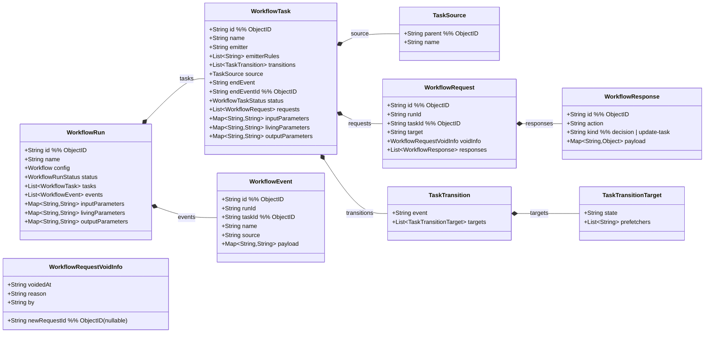
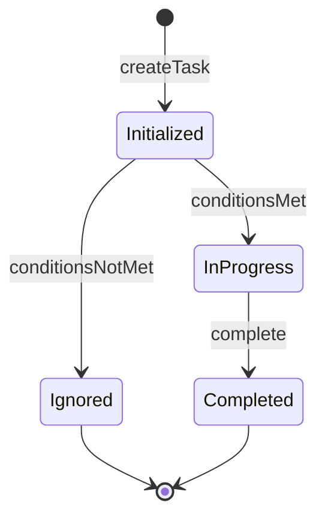
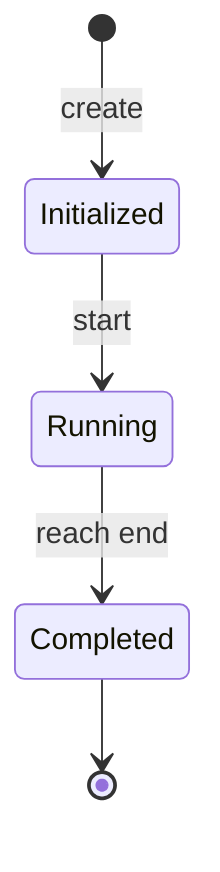
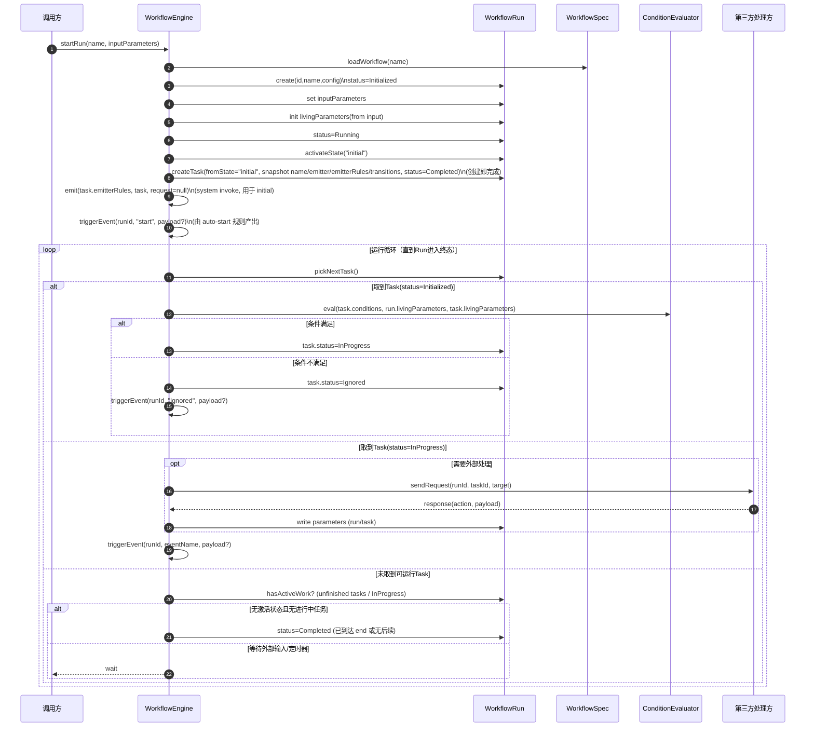
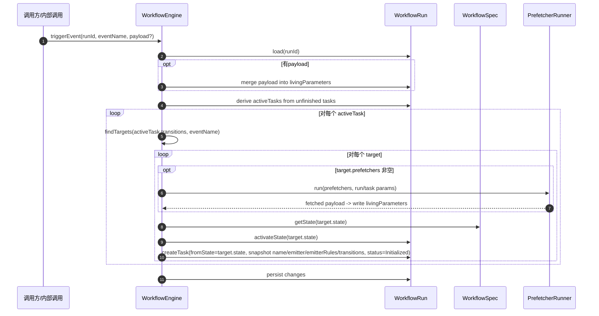
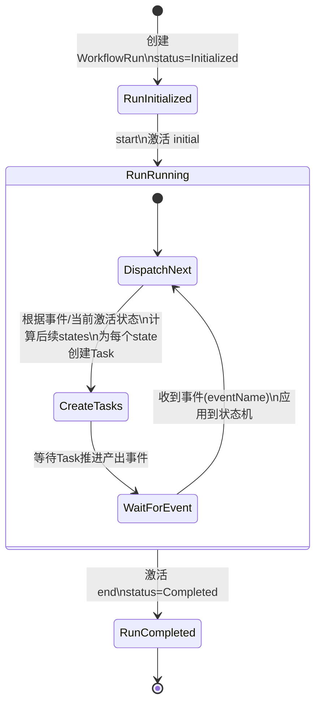
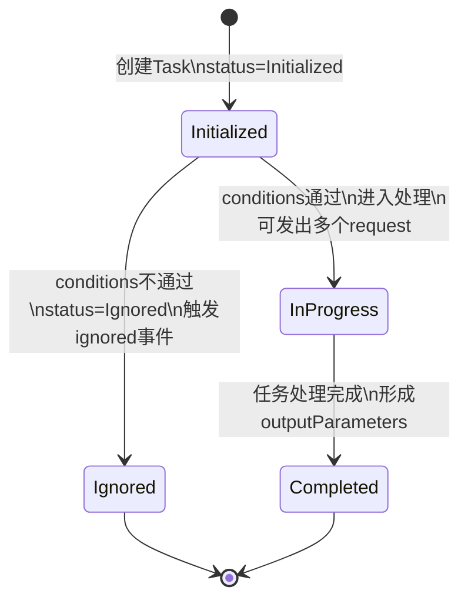

# 运行域（静态 + 动态）— WorkflowRun（第一步）

> 目标：从运行期核心概念 **WorkflowRun** 开始，逐步建立：  
> 1) 运行实例的静态模型（类图）  
> 2) 运行推进的动态模型（状态图/时序图）

本文件先完成 WorkflowRun 的第一版草案，后续再按你的确认继续扩展。

---

## 运行期静态模型：WorkflowRun（草案）

### 设计要点（来自你的约束）
1. `WorkflowRun.id` 格式：`<工作流标识>.<ObjectId>`
   - 工作流标识来自 `Workflow.name`，并将 `/` 替换为 `.`
   - ObjectId 部分用于唯一标识该次运行
   - 示例：`order.approval.507f1f77bcf86cd799439011`
2. 时间字段采用 UTC 字符串：`YYYY-MM-DD HH:mm:ss`
3. 参数 key 命名与 value 类型约束：见配置域文档的"参数命名与类型规则（已确认）"

### 领域类图（Mermaid）

### 字段说明（草案）
- `id`：`<workflowNameWithDots>.<ObjectId>`
  - `workflowNameWithDots = name.replaceAll("/", ".")`
  - 示例：`order.approval.507f1f77bcf86cd799439011`
  - ObjectId 部分可用于提取创建时间
- `name`：引用配置域 `Workflow.name`（path 形式）
- `config`：创建该 WorkflowRun 时所使用的 Workflow 配置（快照/引用策略后续再定）
- `status`：运行状态（见下方状态机草案）
- `tasks`：任务列表（值对象）。每当某个状态被激活，会产生一个新的 Task（并行/汇合细节后续继续细化）
- `inputParameters`：输入参数（字符串字典）
- `livingParameters`：运行中参数（字符串字典）  
  - 约定：任一 Task 结束（Completed / Ignored）时，将 `task.outputParameters` 合并到 `run.livingParameters`
- `outputParameters`：输出参数（字符串字典）

---

## WorkflowTask（草案）

### 基本语义（已对齐）
1. Task 是运行期值对象（VO），由 WorkflowRun 持有 `tasks: List<WorkflowTask>`
2. 每当某个 **state 被激活**，都会产生一个新的 Task
3. **Task 是运行期状态快照（新增，已确认）**：
   - 创建 Task 时，从对应 `WorkflowState` 复制运行所需字段到 Task：
     - `name`
     - `emitter`
     - `emitterRules`
     - `transitions`
   - 目的：
     - 后续运行尽量不再依赖配置域中的原始 `state`
     - 便于支持前/后加签等"动态增添任务"的运行期场景
   - 注：`conditions` 不需要快照，因为只在 Task 创建时执行一次判断，判断后不再使用
4. Task 初始状态为 `initialized`
   - 创建时立即执行 `state.conditions` 判断（从配置域读取）
   - 若 `conditions` 通过：进入 `in-progress`
   - 若不通过：Task 进入 `Ignored`（自动终止的完成态），并统一触发内部事件 `ignored`
5. Task 也拥有三段式参数：
   - `inputParameters`：创建该 Task 时的输入参数（可来自 run.input/living 的快照，策略后续定）
   - `livingParameters`：Task 运行中的实时参数（仅开始后、结束前存在）
   - `outputParameters`：Task 结束后的结果参数（仅结束后存在）
6. **Task 结束时参数回写（已确认）**：
   - 任一 Task 进入终态（`Completed` / `Ignored`）时，将 `task.outputParameters` 合并到 `run.livingParameters`
7. **Task 进入 InProgress 时生成请求（已确认）**：
   - 若 `task.inputParameters` 中存在 `TMP_REQUEST_TARGETS`：
     - 将其值按英文逗号 `,` 分割为 target 列表（建议：trim 空格、忽略空项）
     - 为每个 target 创建一条 `WorkflowRequest`（写入 `task.requests`）
   - 若不存在该参数，则该 Task 默认不自动产生 request（是否仍可通过其他方式推进，后续再定）
8. **Task 的可追溯来源（新增）**：
   - `task.source.parent`：前序任务 id（ObjectId）。表示“是谁触发/推进到激活了本 state”
   - `task.source.name`：触发事件名（内部事件，即 `transition.event`，例如 `passed` / `rejected` / `b_skipped` / `start`）
   - 备注：`initial` 的 Task 可令 `source` 为空或由实现填充（例如 parent=null,name=null）
9. **Task 的结束事件（新增）**：
   - `task.endEvent`：Task 进入终态时记录的“结束事件名”（内部事件，即 `transition.event`）
   - `task.endEventId`：对应的 `WorkflowEvent.id`（ObjectId），用于精确关联导致任务结束的那条事件记录
   - 赋值规则：
     - `Ignored`：固定写入 `"ignored"`
     - `Completed`：写入导致该 Task 完成并推进到后续状态的事件名（例如 `"passed"` / `"rejected"` / `"start"`）
10. **时间字段约定（新增）**：
   - `task.id` 为 ObjectId，可从中推导创建时间，因此 Task 不单独保存 `createdAt`
   - Task 不保存 `updatedAt`，因为没有必要记录更新时间

### Fork/Join（当前取向）
当前版本优先采用“事件驱动 + 启动条件不通过触发事件/忽略任务”的低复杂度方案，不引入 ForkID 机制。

### 已确认默认行为
- 当 `conditions` 不通过：将 Task 置为 `Ignored`，并统一触发内部事件 `ignored`。

---

## WorkflowTask 状态机（草案）

> 说明：该状态机描述 Task 的生命周期。当前以“低复杂度、语义清晰”为主，先给出核心状态；失败/取消等可作为扩展点。

### 状态含义（草案）
- `Initialized`：任务已创建但尚未进入处理（等待 `conditions` 判断）
- `InProgress`：任务进入正常处理流程（可被执行/处理）
- `Completed`：任务处理完成（形成 `outputParameters`）
- `Ignored`：任务因条件不满足被自动终止，不进入处理流程；属于完成态的一种

### 终态回写规则（已确认）
- 当 Task 进入 `Completed` 或 `Ignored`：引擎将 `task.outputParameters` 合并到 `run.livingParameters`
  - 过滤规则：key 以 `TMP_` 开头的参数视为临时参数，不进入 outputParameters，也不参与合并

### 特殊状态任务（强制语义）
- `task.name="initial"`：任务创建即 `Completed`，并通过系统调用执行一次 emitterRules 产出事件 `"start"`（默认可用 `system/start/auto-start`）。
- `task.name="end"`：任务创建即 `Completed`，并驱动 WorkflowRun 进入 `Completed`（结束）。

---

## WorkflowRequest / WorkflowResponse（草案）

### 语义（已对齐）
1. 当 Task 进入 `InProgress` 后，可以发出若干 `request`（对外部处理事件的请求）。
2. 每个 `request` 可以对应多个 `response`（response 作为日志）。
3. **决策类 response 约束（新增，已确认）**：
   - 每个 request 的 responses 中，最多只能有 1 个“决策类 action”的 response
   - 且该决策类 response 必须排在最后（即一旦出现决策类 response，该 request 后续不再接受任何 response）
4. `WorkflowResponse.kind`（新增）：由引擎在写入 response 时根据 emitter 的 `actions[action].kind` 派生并固化，便于规则脚本做过滤与统计（忽略 update-task 日志）。

### 更新任务类响应（新增）
> 说明：部分 `response.action` 不用于推进状态机，而用于更新当前 Task（例如加签：新增请求；作废请求；撤回响应并重新发起）。
> 该类 action 在 emitter 配置中通过 `WorkflowStateEmitter.spec.actions[*].kind="update-task"` 显式声明（见 `15-emitter-domain.md`）。
>
> 当收到 response 且命中 update-task action：
> 1) 引擎将该 response 视为“更新指令”，不产出内部事件、不触发迁移
> 2) 引擎从 `response.payload` 读取更新意图，并应用到当前 task
> 3) 允许的更新（当前已确认）：
>    - 增加 request
>    - 作废 request（无后续新 request；用于“删除请求”的留痕表达）
>    - 撤回 response：**不做置空**，而是将已具备决策类 response 的 request 标记为 `voided`（保留原 responses 留痕），并创建新的 request 重新发起
> 4) 应触发 `task.updated` webhook；若新增 request 且成功发送，触发 `request.sent`；`response.received` 仍在“收到 response”时触发（见下方 webhook 表）
>
> #### response.payload（update-task action 的约定字段）
> > 说明：`WorkflowResponse.payload` 类型为 `Map<String,Object>`，可直接承载列表/对象；字段结构固定。
> - `addRequests`（可选）：要新增的 request 列表（数组，元素为 target 字符串）
> - `voidRequests`（可选）：要作废的 request 列表（数组，元素结构：`{requestId, reason}`）
>   - `requestId`：要作废的 requestId
>   - `reason`：作废原因（字符串）
>
> #### 撤回响应（留痕）字段回写（已确认）
> 当对某条 request 执行撤回响应：
> - 原 request：
>   - 标记为作废：写入 `voidInfo`
>   - `voidInfo.voidedAt`：作废时间（UTC 字符串）
>   - `voidInfo.reason`：作废原因（建议来自 response.payload 的摘要或 action 名）
>   - `voidInfo.by`：作废操作者标识（来源于 response 的 source/操作者上下文，由实现提供）
>   - `voidInfo.newRequestId`：新创建 request 的 id（用于追溯；无替代时可为空）
>   - 保留原 `responses` 不变（留痕）
> - 新 request：创建新 ObjectId，并按正常流程发送

### 字段说明（草案）
- `WorkflowRequest.runId`：关联的运行标识（来自 `WorkflowRun.id`）。
- `WorkflowRequest.taskId`：关联的任务标识（ObjectId）。
- `WorkflowRequest.target`：目标处理方标识，例如：
  - `user:<工号>`
  - `sys:<系统标识>`
- `WorkflowRequest.id`：ObjectId（可从中推导创建时间，因此不单独保存 `createdAt`）。
- `WorkflowRequest.voidInfo`：作废信息值对象；存在即表示该 request 已作废（voided）
  - `voidedAt`：作废时间（UTC 字符串）
  - `reason`：作废原因
  - `by`：作废操作者标识
  - `newRequestId`：后续新 requestId（可空；删除请求/纯作废时为空）
- `WorkflowResponse.id`：ObjectId（用于幂等与追溯；可从中推导创建时间）
- `WorkflowResponse.action`：响应动作标识
- `WorkflowResponse.kind`：操作类别（decision/update-task），由引擎根据 emitter 配置派生
- `WorkflowResponse.payload`：响应数据（Map<String,Object>）

### 基于参数的发请求方案（已确认）
- 参数名：`TMP_REQUEST_TARGETS`
- 参数位置：`task.inputParameters`
- 参数值：用英文逗号 `,` 分隔的 target 列表（字符串）
  - 示例：`user:10086,user:10010,sys:risk`
- 生成规则：Task 进入 `InProgress` 时按该列表生成 `task.requests`

### Webhook 参与时机（运行逻辑扩展点）
> 说明：
> - webhook 不作为独立配置领域建模，仅在运行逻辑中定义触发点与 payload 约定
> - 投递语义：至多一次（发送失败不重试）
> - `initial/end` 两个系统保留状态的 task 不触发 webhook
> - `Ignored` 不触发 webhook
> - **Webhook 职责**：既用于事件通知（如 run.started、task.completed），也用于发送 WorkflowRequest（通过 request.target 指定 webhook URL）
>
> 概念辨析（重要）：
> - webhook：面向外部系统集成（外部系统可读）
> - WorkflowEvent：面向用户审计/回放（人可读）
> 二者不是一回事；webhook 可在 payload 中携带 `workflowEventId` 以便关联（见 ADR-027）。
>
> 事件清单与 payload 约定（按你的最新要求；下表中的 payload 字段为 **HTTP 请求体** 的字段集合）：
>
> **Webhook 列表（逐条展开）**
>
> | webhook 名称 | 触发时机（何时触发） | payload 字段（该时机完整展开） |
> |---|---|---|
> | `run.started` | `startRun` 成功后，run 进入 `Running` | `run`（WorkflowRun，全量） |
> | `run.completed` | run 到达 `end` 并进入 `Completed` | `run`（WorkflowRun，全量） |
> | `task.started` | 非 `initial/end` 的 task 进入 `InProgress` | `run`（全量）；`taskId`；`emitter`（上游任务的 emitter 实体对象） |
> | `task.completed` | 非 `initial/end` 的 task 进入 `Completed`（Ignored 不触发） | `run`（全量）；`taskId`；`event`（导致任务结束的事件）；`emitter`（触发事件的 emitter 实体对象）；`emitterRule`（触发事件的规则实体对象） |
> | `request.sent` | Webhook 成功投递某条 request 后 | `run`（全量）；`taskId`；`request`（WorkflowRequest 实体）；`emitter`（当前任务的 emitter 实体对象） |
> | `response.received` | 外部系统提交 response 后（写入 request.response 成功） | `run`（全量）；`taskId`；`requestId`；`payload`（应答 payload） |
> | `task.updated` | 非 `initial/end` 的 task 发生更新后（用于可视化刷新；Ignored 不触发） | `run`（全量）；`task`（更新后的 WorkflowTask，全量） |

---

## WorkflowRun 状态机（草案）

> 注：Suspended/Retrying 等中间态后续按需要加入。

---

## 关键用例时序图（待确认后补充）
- startRun（启动运行）
- fireEvent（触发事件，推进状态机）

---

## 下一步（建议）
1. 定义“事件触发”的输入输出（例如 triggerEvent(eventName, payload)）
2. 再补充时序图：startRun / triggerEvent

---

## WorkflowRun 执行流程（动态模型）

> 说明：你问到“动态模型中 WorkflowRun 的执行流程”，这里用两张 Mermaid 时序图描述：  
> 1) 从 `startRun` 开始进入循环，直到运行结束  
> 2) 循环中关键的“触发事件推进”（这里称为 `triggerEvent`，等价于“把一个事件应用到状态机上”）

### 1) 从启动到循环结束（总览时序图）

### 2) triggerEvent（事件推进状态机的细节）

> `triggerEvent`（也可叫 fireEvent）= 在运行中把一个事件应用到当前激活状态集上：  
> - 找到所有匹配 `eventName` 的 transition targets  
> - 依次执行 target.prefetchers（若有）  
> - 激活目标 state 并创建对应 Task  
>   - 若目标为 `end`：Task **创建即完成**，并驱动 WorkflowRun 进入 Completed  
>   - 否则：Task 初始为 Initialized；后续由 **task.conditions** 决定任务是否 InProgress 或 Ignored
> - 创建 Task 时，从目标 `WorkflowState` 复制 `name/conditions/emitter/emitterRules/transitions` 到 Task，形成运行期快照

---

## 动态模型（拆分三张状态图）

> 说明：按你的要求，将“工作流（WorkflowRun）/任务（WorkflowTask）/请求（WorkflowRequest）”拆成三张状态图分别表达。  
> 其中 Request 图仅表达动态过程，不代表一定要在模型中引入 `RequestStatus` 字段。

### 1) 工作流实例（WorkflowRun）执行循环（状态图）

### 2) 任务（WorkflowTask）生命周期（状态图）

### 3) 请求（WorkflowRequest）处理过程（状态图）

---

## WorkflowEvent（运行期事件）

> 说明：事件用于驱动 WorkflowRun 的状态机推进。事件通常由 emitter-rule 在收到 response 后产生，也可能由其他内部逻辑产生（例如条件不满足触发的 `ignored`）。

### 字段（已确认）
- `id`：ObjectId
- `runId`：关联的运行标识（来自 `WorkflowRun.id`）
- `taskId`：关联的任务标识（ObjectId）
- `name`：事件名
- `source`：事件来源标识（例如用户ID）
- `payload`：事件数据（字符串字典）

---

## Emitter（事件触发器，配置驱动）

> 作用：当 Task 处于 `InProgress` 且某个 request 收到 `response` 时，决定“是否触发事件推进 WorkflowRun”。  
> 本模型中 emitter **归属配置域**：`WorkflowState.emitter` 用于定义可执行操作清单；触发判定由 `WorkflowState.emitterRules`（规则链）完成。  
> 你已确认：
> 1. **每次收到 decision response 都会触发一次 emit**（一次 decision response -> 一次 emitter 执行；update-task response 走独立更新管线）
> 2. emit 的输入至少包含：`task` 与 `request`（可读取 task/run 参数与已累积的请求响应情况）
> 3. emit 的输出：要么产生一个事件（推进状态机），要么什么也不产生（例如“所有人都通过才进入下一状态”的聚合判断未满足时不触发）
> 4. 若产生事件，则 **eventName 取 emitter 输出**（可能与 `response.action` 不同，例如 `accept/refuse` 聚合后输出 `passed`）
> 5. 对外可执行操作清单来自 `WorkflowStateEmitter.spec.actions`（含显示名称与 kind）；`response.action` 是否必须属于该集合由实现决定（建议校验）
> 6. emitter 可选声明 `WorkflowStateEmitter.spec.allowedEvents`（含显示名称）作为“可能产出的内部事件清单”，用于 UI 展示与对规则链产出 `event.name` 的校验（建议校验）
