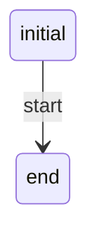
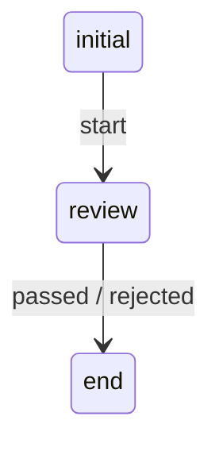
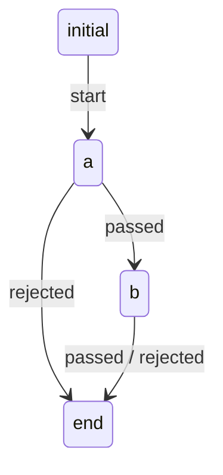
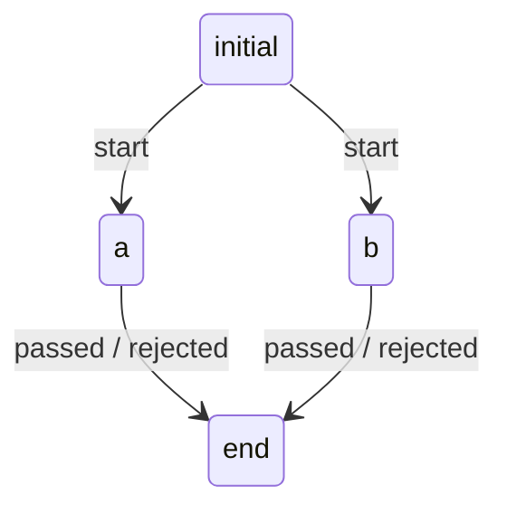
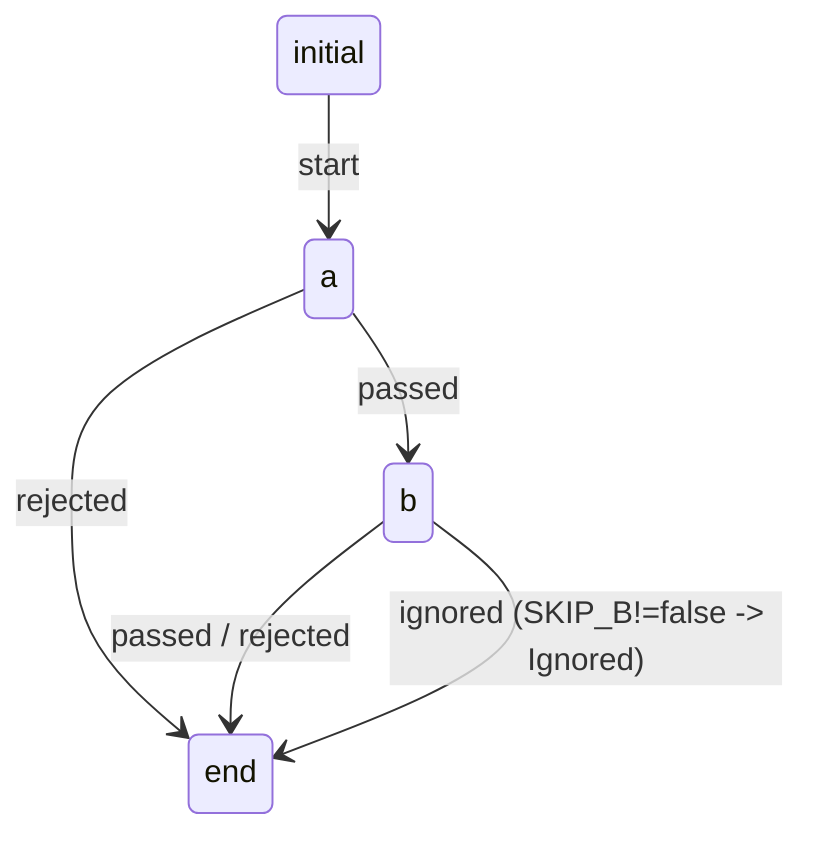
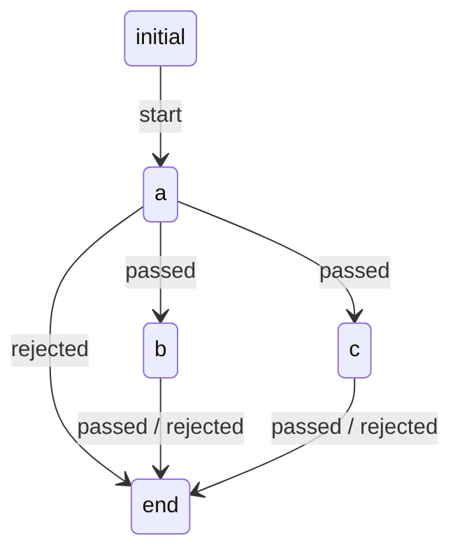
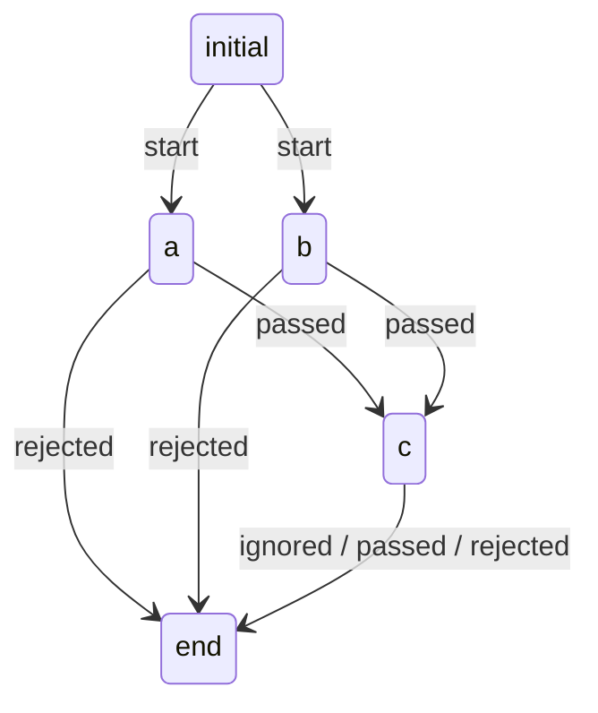

# 工作流示例（从简单到复杂）

> 说明：
> - 所有示例都遵循当前配置模型：`kind/name/metadata/spec`
> - `spec.states` 中必须包含系统保留状态：`initial` 与 `end`
> - **迁移 target 不再支持 conditions**：仅保留 `state.conditions`（脚本门控）；当脚本判定不通过时统一触发内部事件 `"ignored"`，并由该 state 的 `transition.event="ignored"` 定义绕行/汇合路径
> - 下面示例只展示与结构相关的字段；未出现的可选字段默认为空
> - `transition.event` 为**内部事件名**；`response.action` 为第三方操作名，二者可一致也可不同（由 `state.emitterRules` 规则链聚合映射）
>   - 规则引用：`EmitterRule.name = <state.emitter>/<ruleKey>`（`ruleKey` 来自 `state.emitterRules[*]`）

---

## 1）空工作流（只有开始、结束）

### 配置示例（YAML）
```yaml
kind: workflow
name: demo/empty
metadata:
  title: 空工作流
spec:
  states:
    - name: initial
      title: 开始
      emitter: system/start
      emitterRules: [auto-start]
      transitions:
        - event: start
          targets:
            - state: end
              prefetchers: []
    - name: end
      title: 结束
```

### 图示（Mermaid）


---

## 2）单状态工作流（只有一个用户定义的状态）

```yaml
kind: workflow
name: demo/single
metadata:
  title: 单状态工作流
spec:
  states:
    - name: initial
      title: 开始
      emitter: system/start
      emitterRules: [auto-start]
      transitions:
        - event: start
          targets:
            - state: review
              prefetchers: [demo/request-targets]
    - name: review
      title: 审核
      emitter: demo/approval
      emitterRules: [veto, any-accept]
      transitions:
        - event: passed
          targets:
            - state: end
              prefetchers: []
        - event: rejected
          targets:
            - state: end
              prefetchers: []
    - name: end
      title: 结束
```



---

## 3）两个状态顺序工作流

```yaml
kind: workflow
name: demo/two-seq
metadata:
  title: 两状态顺序
spec:
  states:
    - name: initial
      title: 开始
      emitter: system/start
      emitterRules: [auto-start]
      transitions:
        - event: start
          targets:
            - state: a
              prefetchers: [demo/request-targets]
    - name: a
      title: 状态A
      emitter: demo/approval
      emitterRules: [veto, any-accept]
      transitions:
        - event: passed
          targets:
            - state: b
              prefetchers: [demo/request-targets]
        - event: rejected
          targets:
            - state: end
              prefetchers: []
    - name: b
      title: 状态B
      emitter: demo/approval
      emitterRules: [veto, any-accept]
      transitions:
        - event: passed
          targets:
            - state: end
              prefetchers: []
        - event: rejected
          targets:
            - state: end
              prefetchers: []
    - name: end
      title: 结束
```



---

## 4）两个状态并行工作流（A 与 B 并行）

> 说明：并行通过一次事件 fan-out 到多个 `targets` 来表达。

```yaml
kind: workflow
name: demo/two-parallel
metadata:
  title: 两状态并行
spec:
  states:
    - name: initial
      title: 开始
      emitter: system/start
      emitterRules: [auto-start]
      transitions:
        - event: start
          targets:
            - state: a
              prefetchers: [demo/request-targets]
            - state: b
              prefetchers: [demo/request-targets]
    - name: a
      title: 并行A
      emitter: demo/approval
      emitterRules: [veto, any-accept]
      transitions:
        - event: passed
          targets:
            - state: end
              prefetchers: []
        - event: rejected
          targets:
            - state: end
              prefetchers: []
    - name: b
      title: 并行B
      emitter: demo/approval
      emitterRules: [veto, any-accept]
      transitions:
        - event: passed
          targets:
            - state: end
              prefetchers: []
        - event: rejected
          targets:
            - state: end
              prefetchers: []
    - name: end
      title: 结束
```



---

## 5）两个状态顺序执行，前任务可跳过后任务

> 目标：A 完成后进入 B；若需要跳过 B，则让 B 的 `state.conditions` 判定不通过，从而 B 的 Task 自动 `Ignored`，并通过该 state 的 `event: ignored` 迁移绕行到 end。

```yaml
kind: workflow
name: demo/skip-next
metadata:
  title: 可跳过后续任务
spec:
  states:
    - name: initial
      title: 开始
      emitter: system/start
      emitterRules: [auto-start]
      transitions:
        - event: start
          targets:
            - state: a
              prefetchers: [demo/request-targets]
    - name: a
      title: 前置任务A
      emitter: demo/approval
      emitterRules: [veto, any-accept]
      transitions:
        - event: passed
          targets:
            - state: b
              prefetchers: [demo/request-targets]
        - event: rejected
          targets:
            - state: end
              prefetchers: []
    - name: b
      title: 后置任务B
      emitter: demo/approval
      emitterRules: [veto, any-accept]
      # 当 skip_b=true 时，B 任务会被 Ignored，并触发 b_skipped 事件绕行到 end
      conditions: |
        // pass 表示进入 InProgress；不通过则 Ignored 并触发 ignored 事件
        result.pass = (parameters["SKIP_B"] === "false");
      transitions:
        - event: ignored
          targets:
            - state: end
              prefetchers: []
        - event: passed
          targets:
            - state: end
              prefetchers: []
        - event: rejected
          targets:
            - state: end
              prefetchers: []
    - name: end
      title: 结束
```



---

## 6）一个前任务 + 两个后任务（先A，再并行B/C）

```yaml
kind: workflow
name: demo/one-to-two
metadata:
  title: 一前两后
spec:
  states:
    - name: initial
      title: 开始
      emitter: system/start
      emitterRules: [auto-start]
      transitions:
        - event: start
          targets:
            - state: a
              prefetchers: [demo/request-targets]
    - name: a
      title: 前置任务A
      emitter: demo/approval
      emitterRules: [veto, any-accept]
      transitions:
        - event: passed
          targets:
            - state: b
              prefetchers: [demo/request-targets]
            - state: c
              prefetchers: [demo/request-targets]
        - event: rejected
          targets:
            - state: end
              prefetchers: []
    - name: b
      title: 后置任务B
      emitter: demo/approval
      emitterRules: [veto, any-accept]
      transitions:
        - event: passed
          targets:
            - state: end
              prefetchers: []
        - event: rejected
          targets:
            - state: end
              prefetchers: []
    - name: c
      title: 后置任务C
      emitter: demo/approval
      emitterRules: [veto, any-accept]
      transitions:
        - event: passed
          targets:
            - state: end
              prefetchers: []
        - event: rejected
          targets:
            - state: end
              prefetchers: []
    - name: end
      title: 结束
```



---

## 7）两个前任务 + 一个后任务（并行A/B，再汇总到C）

> 说明：这里用一个“汇总状态”`c` 来表达汇合后的后续处理。  
> 为避免“并行两条边各自触发导致重复创建 c 的任务”，通常需要引擎实现幂等（例如：同一 run + 同一 stateName 的未结束任务只创建一次），或依赖 **state.emitterRules** 规则链做聚合后再产出事件。此处先给出编排形态示例。

```yaml
kind: workflow
name: demo/two-to-one
metadata:
  title: 两前一后
spec:
  states:
    - name: initial
      title: 开始
      emitter: system/start
      emitterRules: [auto-start]
      transitions:
        - event: start
          targets:
            - state: a
              prefetchers: [demo/request-targets]
            - state: b
              prefetchers: [demo/request-targets]
    - name: a
      title: 前置任务A
      emitter: demo/approval
      emitterRules: [veto, any-accept]
      transitions:
        - event: passed
          targets:
            - state: c
              prefetchers: [demo/request-targets]
        - event: rejected
          targets:
            - state: end
              prefetchers: []
    - name: b
      title: 前置任务B
      emitter: demo/approval
      emitterRules: [veto, any-accept]
      transitions:
        - event: passed
          targets:
            - state: c
              prefetchers: [demo/request-targets]
        - event: rejected
          targets:
            - state: end
              prefetchers: []
    - name: c
      title: 汇总后任务C
      emitter: demo/approval
      emitterRules: [veto, any-accept]
      # 可选：用 state.conditions 做门控（例如等待两个前置都完成）
      conditions: |
        result.pass = (parameters["A_PASSED"] === "true" && parameters["B_PASSED"] === "true");
      transitions:
        - event: ignored
          targets:
            - state: end
              prefetchers: []
        - event: passed
          targets:
            - state: end
              prefetchers: []
        - event: rejected
          targets:
            - state: end
              prefetchers: []
    - name: end
      title: 结束
```



---

## 附：layout（可选）示例（仅用于 UI 布局）

> 说明：`spec.layout` 仅用于前端画布布局展示，不参与运行语义。  
> 其中：
> - `layout.states` 的 key 为 `state.name`
> - `layout.transitions` 的 key 为 `<fromState>::<event>`（同一 state 内 event 唯一，便于定位一条迁移）

```yaml
kind: workflow
name: demo/workflow
metadata:
  title: 未命名工作流
spec:
  states:
    - name: initial
      title: 开始
      emitter: system/start
      emitterRules:
        - auto-start
      transitions:
        - event: start
          targets:
            - state: state_1777121191808
              prefetchers: []
    - name: state_1777121191808
      title: 新任务
      emitter: demo/approval
      emitterRules:
        - veto
      transitions:
        - event: passed
          targets:
            - state: end
              prefetchers: []
            - state: state_1777121191808
              prefetchers: []
    - name: end
      title: 结束
      transitions: []
  layout:
    states:
      initial:
        x: 280
        y: 50
      state_1777121191808:
        x: 280
        y: 200
      end:
        x: 280
        y: 350
    transitions:
      initial::start:
        x: 325
        y: 125
      state_1777121191808::passed:
        x: 607
        y: 276
```
